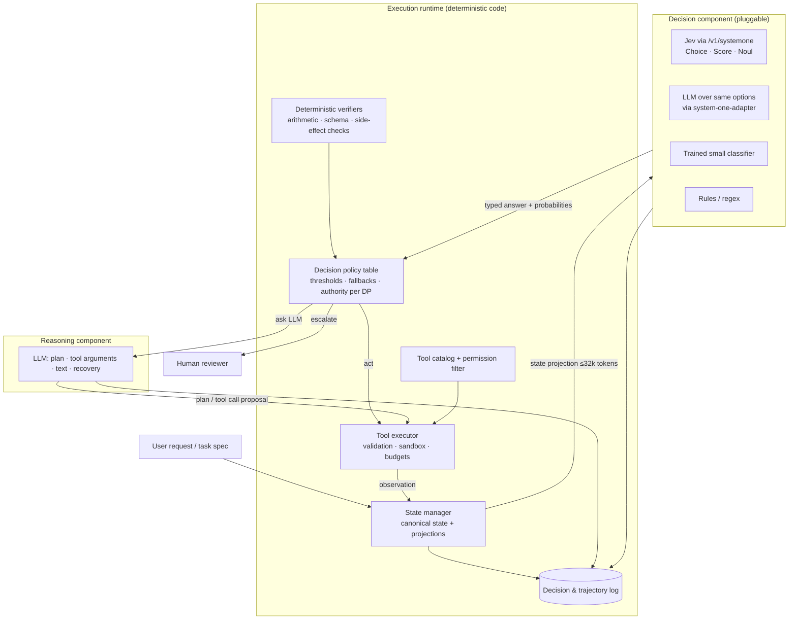
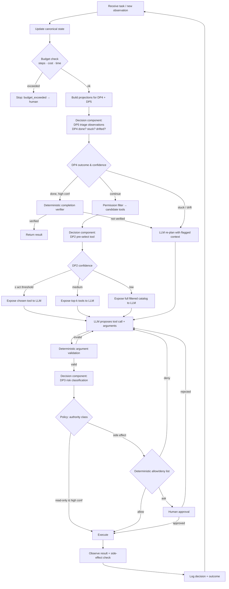
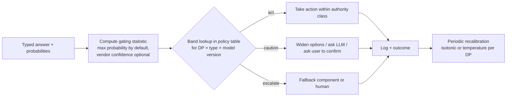
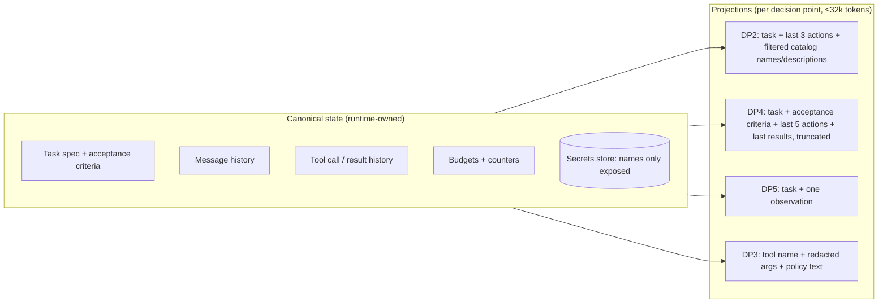
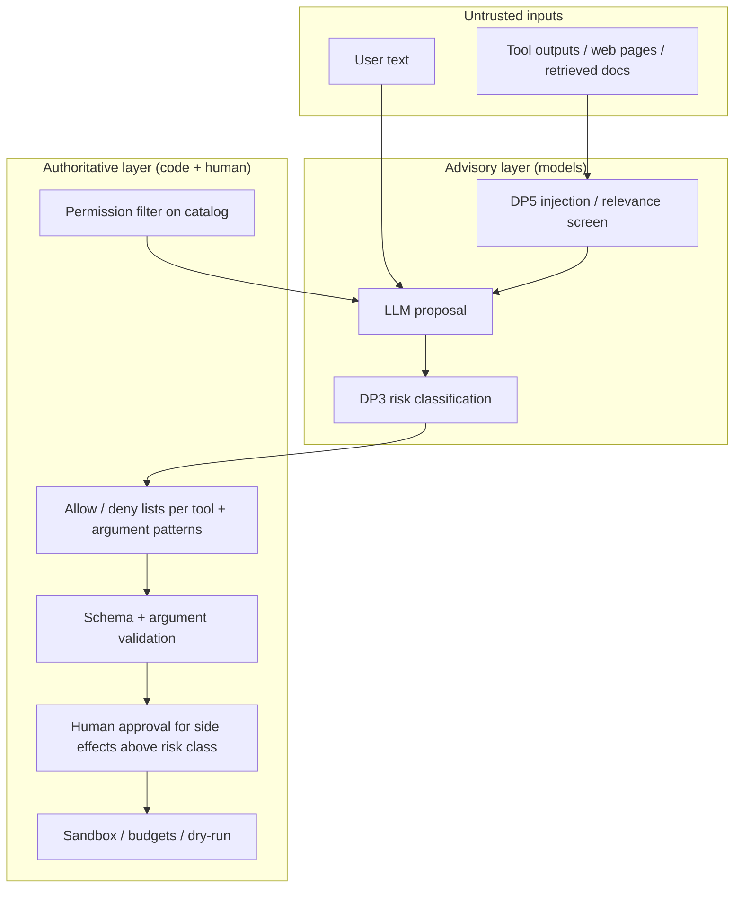
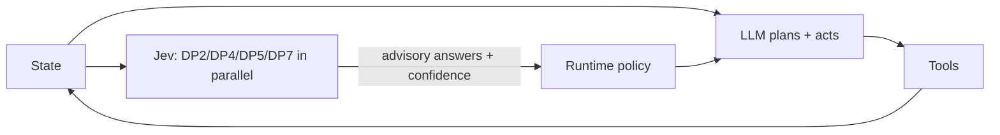
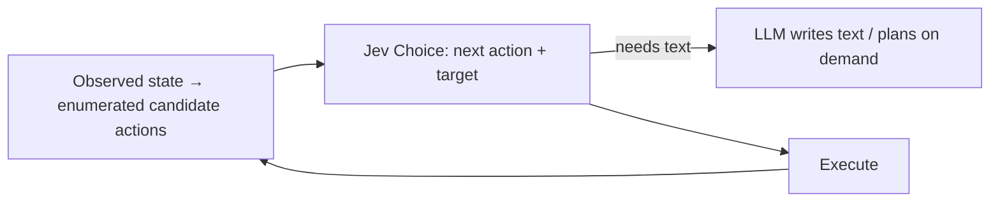
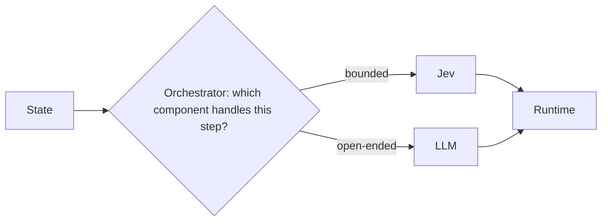
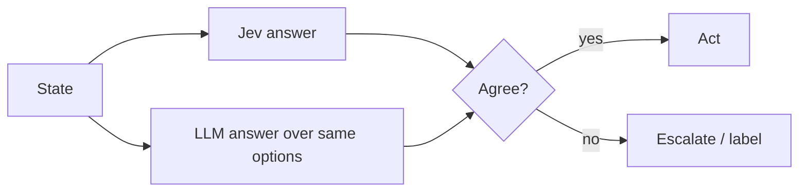

# ARCHITECTURE.md — Jev × LLM Agent: System Design (Conditional)

**Status:** Design proposal, conditional on the research gate in [RESEARCH.md](RESEARCH.md) (outcome: **MODIFY**). Nothing in this document has been implemented. No code exists.

**Companion documents:** [RESEARCH.md](RESEARCH.md) (what Jev is and what the evidence says) · [IMPLEMENTATION_PLAN.md](IMPLEMENTATION_PLAN.md) (phased roadmap) · [DECISION_LOG.md](DECISION_LOG.md) (assumptions, decisions, open questions).

**Question this document answers:** *What could the system look like, and why?*

---

## 0. How to read this document

Every design element below carries one of four evidence labels. The labels are used consistently across all four documents.

| Label | Meaning |
|---|---|
| **[DOC]** | Verified in TypeSafe's official documentation (link given). |
| **[IND]** | Supported by at least one independent, non-vendor measurement (link given). |
| **[VENDOR]** | Claimed by TypeSafe (docs, cookbooks, blog, evals dashboard), not independently verified. |
| **[HYP]** | Our own hypothesis or proposed abstraction. Not a claim about Jev's actual behavior or API. |

The word **Jev** always means the model `jev-1.13.0` (alias `jev-latest`) exposed through `POST https://api.typesafe.ai/v1/systemone` **[DOC]** ([Models](https://docs.typesafe.ai/models), [API](https://docs.typesafe.ai/api)). Interface sketches in this document are conceptual; they are not API signatures.

---

## 1. Problem statement

LLM-driven agents make many small, bounded decisions on every loop iteration: which tool to call next, whether the task is finished, whether a proposed action is risky, whether a retrieved passage is relevant, whether to escalate. Today these decisions are usually made by the same large model that does planning and generation, which means:

1. Each decision costs a full generative call (seconds, dollars-per-thousand), so agents avoid asking cheap questions often.
2. Decisions are emitted as text or tool-call JSON and carry no usable uncertainty signal; runtimes cannot tell a confident choice from a coin flip.
3. Decision quality degrades as context grows, and the runtime cannot cheaply re-check the model's own claims ("done", "safe", "relevant").

The hypothesis under evaluation ([RESEARCH.md §6](RESEARCH.md#6-critical-analysis-of-the-original-hypothesis)) is that a dedicated decision model returning **typed answers with probabilities** could make some of these decisions faster, cheaper, and more inspectable than the LLM, and that its confidence could drive escalation. The research found this hypothesis is **partly** supported: Jev is documented and independently measured to be fast and cheap on bounded, single-hop judgments over compact state, but its accuracy sits below frontier LLMs on harder judgments, its calibration is imperfect out of distribution, and vendor-recommended integration patterns already exist in LangChain and Pydantic AI ([RESEARCH.md §5](RESEARCH.md#5-existing-systems-and-related-work)).

Consequently this document does **not** design a general-purpose Jev-centric agent framework. It designs the smallest architecture needed to (a) insert a decision component at well-defined points of an LLM agent loop and (b) measure whether doing so helps. The decision component is pluggable so that Jev can be compared against an LLM answering the same typed questions, a small classifier, and deterministic rules.

---

## 2. Design goals and non-goals

### Goals

| # | Goal | Rationale |
|---|---|---|
| G1 | **Decision points are explicit runtime constructs**, not prompt text. Each has a typed answer space, a state projection, a confidence policy, and a fallback. | Makes decisions inspectable, testable, and swappable. Matches TypeSafe's own guidance to keep control flow in code **[DOC]** ([How to build](https://docs.typesafe.ai/concepts/how-to-build-with-system-one)). |
| G2 | **Decision components are pluggable and comparable.** The same decision point can be served by Jev, by an LLM over the same options, by a trained classifier, or by rules. | Required for honest evaluation; TypeSafe ships an MIT adapter that does exactly this for LLM backends ([system-one-adapter-python](https://github.com/typesafe-ai/system-one-adapter-python)). |
| G3 | **Confidence is a first-class input to control flow**, with thresholds set from labeled data and pinned to a model version. | Confidence-gated routing is the documented pattern **[DOC]** ([Confidence](https://docs.typesafe.ai/confidence)); independent studies show thresholds do not transfer across tasks or primitive types **[IND]** ([jev-ood-calibration](https://github.com/scienthoon/jev-ood-calibration)). |
| G4 | **Deterministic code owns safety, permissions, secrets, arithmetic, and verification of side effects.** Models advise; code decides. | Jev's documented weaknesses (arithmetic, dates, adversarial state) **[DOC]** ([Jev 1.13 jaggedness](https://docs.typesafe.ai/model-jaggedness/jev-1.13)) and third-party guidance that a typed-judgment model must not be the blocking security gate ([teatree issue](https://github.com/souliane/teatree/issues/4819)). |
| G5 | **Every decision is logged** with inputs, options, probabilities, chosen action, and eventual outcome. | Needed for calibration measurement, threshold fitting, failure analysis, and the evaluation in [IMPLEMENTATION_PLAN.md](IMPLEMENTATION_PLAN.md). |
| G6 | **Graceful degradation.** If the decision component is unavailable, slow, or below confidence, the agent continues with a defined fallback (LLM decides, or human, or safe default). | Jev is early access with rate limits that "adjust dynamically" **[DOC]** ([Models](https://docs.typesafe.ai/models)); third parties report outages of minutes and tail latencies of 10–35 s under high concurrency **[IND]** ([Aman Kumar](https://amankumar.ai/blogs/jev-measured)). |

### Non-goals

| # | Non-goal | Why |
|---|---|---|
| N1 | Building a new general-purpose agent framework or a new tool protocol. | LangGraph, OpenAI Agents SDK, Pydantic AI, and others already exist; two of them already ship Jev integrations. See [RESEARCH.md §5](RESEARCH.md#5-existing-systems-and-related-work). |
| N2 | Using Jev for planning, argument generation, text, code, or multi-hop reasoning. | Explicitly unsupported or weak **[DOC]** ([System One](https://docs.typesafe.ai/concepts/system-one), [jaggedness](https://docs.typesafe.ai/model-jaggedness/jev-1.13)). |
| N3 | Using Jev as the sole authorization or security boundary. | Adversarial content is a documented weakness **[DOC]**; LangChain's own middleware "refuses risky calls. It does not request approval" and warns against sending secrets ([LangChain docs](https://docs.langchain.com/oss/python/integrations/providers/typesafe)). |
| N4 | Replacing the LLM for the whole loop ("Jev-first") as the default design. | Viable only where the action space is enumerable from observed state (see §11, Architecture B). |
| N5 | Multi-agent orchestration, long-term memory systems, or a UI. | Out of MVP scope; see [IMPLEMENTATION_PLAN.md](IMPLEMENTATION_PLAN.md). |

---

## 3. Decision-point taxonomy

The architecture is organized around seven decision points (DP1–DP7) that recur in agent loops. For each, the table records the natural Jev primitive, the evidence that Jev can serve it, and the risk class that determines how much authority the decision component may have.

| ID | Decision point | Typical answer space | Jev primitive **[DOC]** | Evidence Jev can serve it | Risk class → authority |
|---|---|---|---|---|---|
| DP1 | **Intent / route classification** (which handler, which model tier) | 3–20 options | Choice (+ Score for complexity) | **[DOC]** [Intent Routing pattern](https://docs.typesafe.ai/patterns/intent-routing); **[IND]** intent accuracy on Banking77 0.832 / CLINC150 0.870 vs frontier LLM 0.875 / 0.915 and a supervised encoder 0.933 ([jev-baselines-eval](https://github.com/ickma2311/jev-baselines-eval)) | Low → may act automatically above threshold |
| DP2 | **Tool / skill pre-selection** from a large catalog | 10–255 options | Choice (+ Noul "is any tool needed") | **[VENDOR]** [Skill suggestion cookbook](https://docs.typesafe.ai/cookbooks/skill_suggestion): wrong loads 16.8%→7.3% on 488 requests; **[IND]** harness exists but no published numbers ([jev-eval-agent](https://github.com/vinilana/jev-eval-agent)) | Low–medium → narrows candidates; LLM still fills arguments |
| DP3 | **Action-risk / permission classification** of a proposed tool call | readonly / destructive / privileged / exfiltration; or allow / ask / deny | Choice or Noul | **[IND]** 91.7% on 60 hand-labeled calls, 71.4% on ambiguous slice, every wrong answer had hedged confidence ([jev-benchmark](https://github.com/themsquared/jev-benchmark)); **[VENDOR]** LangChain `AutoModeMiddleware`, Vercel `fx` reviewer | **High → advisory only.** Deterministic allow/deny lists and human approval remain authoritative. |
| DP4 | **Progress monitoring**: is the task done? is the agent stuck / looping / drifting from goal? | yes/no; or {continue, done, stuck, escalate} | Noul / Choice | **[VENDOR]** "done" gate in jev-eval-agent; **[VENDOR]** recipes only, synthetic ([jev-skill](https://github.com/wuyoscar/jev-skill)); **[IND]** none | Medium → can trigger re-planning or escalation; cannot declare success without deterministic verification |
| DP5 | **Observation triage**: relevance of tool output / retrieved passage; prompt-injection screening; context pruning | per-item yes/no | Noul (one per item) | **[VENDOR]** [Classifying RAG passages](https://docs.typesafe.ai/cookbooks/classifying_rag_passages), [LLM guardrails](https://docs.typesafe.ai/cookbooks/llm_guardrails); community compaction tools ([awesome-jev](https://github.com/yibie/awesome-jev)) | Medium → filter, never the only injection defense **[DOC]** |
| DP6 | **Output verification**: does the evidence support the claim? does the output meet acceptance criteria? | supports / contradicts / says_nothing; per-criterion yes/no | Choice / Noul | **[VENDOR]** [Citation check](https://docs.typesafe.ai/cookbooks/citation_check) (8 cases); **[IND]** rubric grading agreement with Claude Fable 5.1 91.5% on 6,003 checks, no human ground truth ([Good Start Labs](https://goodstartlabs.com/research/verification-is-the-bottleneck)) | Medium → routes to review; cannot certify correctness |
| DP7 | **Escalation**: does this step need a stronger model or a human? | yes/no, or tier | Noul / Choice + confidence from any DP | **[DOC]** [Confidence-gated routing](https://docs.typesafe.ai/patterns/confidence-routing); **[IND]** cascade Jev→frontier escalated 22% vs nano-LLM 48.5% to reach 90.5% on Banking77, CI includes zero ([jev-baselines-eval](https://github.com/ickma2311/jev-baselines-eval)) | Low → acts on control flow only |

**Design rule (from the taxonomy):** Jev is a candidate only for decisions whose answer space is closed, whose relevant state fits in ~32k tokens **[DOC]**, and whose consequences can be bounded by code. DP3 is included for *measurement* because the ecosystem is already using Jev there, but in this design it never has authority to permit a side effect on its own.

---

## 4. Recommended architecture: decision-gated LLM agent

This is Architecture A/E from §11 (LLM-first, hierarchical control), chosen because it is the only variant whose Jev dependencies are all **[DOC]** or **[IND]**. It is deliberately close to what LangChain's middleware and Pydantic AI's `TypeSafeModel` already allow, so that an implementation can reuse those integrations rather than compete with them.

### 4.1 Component diagram



### 4.2 Component responsibilities

| Component | Owns | Never does |
|---|---|---|
| **State manager** | Canonical agent state (task spec, messages, tool history, observations, budgets); builds *projections* per decision point (§7). | Sends raw full history to Jev (context rot **[DOC]**; 32k state limit **[DOC]**). |
| **Decision policy table** | Per-DP: which decision component, confidence thresholds, what to do in each confidence band, authority class, fallback. Versioned with the model ID. | Learns or changes thresholds at runtime without labeled data. |
| **Decision component** | Answers typed questions about a projection; returns probabilities and (for Choice/Score) confidence. | Generates text, arguments, or plans **[DOC]**. Executes anything. |
| **Reasoning component (LLM)** | Task planning, decomposition, tool-argument generation, natural-language output, recovery when decisions are low-confidence. | Bypasses the permission filter or verifiers. |
| **Tool catalog + permission filter** | The closed set of tools, their descriptions written as Choice criteria, and deterministic filtering by user permissions and current state before any model sees them. | Lets a model add a tool that is not in the catalog. |
| **Tool executor** | Argument validation against schemas, sandboxing, retries, budgets (steps, cost, time), side-effect confirmation. | Trusts a model's claim that an action succeeded ([Reticle](https://www.reticle.sh/blog/typesafe-jev-playbook) documents a 0.95-probability "send" with no observable effect). |
| **Deterministic verifiers** | Counting, arithmetic, date math, schema checks, exact-match checks, final-state checks. | Delegates these to Jev **[DOC]** (jaggedness: "not a calculator", dates read as text). |
| **Decision & trajectory log** | Append-only record of every decision (inputs hash, options, probabilities, confidence, chosen action, latency, cost, model version) and every outcome. | Stores secrets or raw credentials. |
| **Human reviewer** | Approvals for high-risk actions; adjudication of low-confidence decisions; labeling for calibration. | — |

---

## 5. Agent lifecycle and data flow

### 5.1 One loop iteration



### 5.2 Notes on the flow

- **Speculative fan-out [DOC].** All questions for one iteration that share a projection (DP4 done/stuck/drift, DP5 per-observation relevance and injection, DP7 escalation) are sent in one request; unused answers are ignored ([Speculative Fan-Out](https://docs.typesafe.ai/patterns/fan-out), [Parallel questions](https://docs.typesafe.ai/cookbooks/parallel_questions)). Questions are independent and cannot see each other's answers **[DOC]**, so any dependent question (e.g., DP2 after DP4) requires a second request.
- **Two requests per iteration is the expected cost [HYP].** One for monitoring/triage, one for tool pre-selection over the *filtered* catalog, plus one DP3 request per proposed side-effecting call. Whether this is cheaper end-to-end than an LLM-only loop is exactly what the evaluation must establish; it is not assumed.
- **The LLM is always on the path for arguments and text [DOC].** Jev cannot produce strings; arguments must be generated by the LLM or, where arguments are closed sets, selected by Choice as in the [Function calling cookbook](https://docs.typesafe.ai/cookbooks/function_calling) **[VENDOR]**.
- **Completion is never declared by a model alone [HYP, following DOC weaknesses].** DP4 "done" with high confidence only triggers the deterministic completion verifier (expected final state, required artifacts present, tests pass). If no verifier exists for a task type, "done" routes to the human.

### 5.3 Sequence view (single decision)

```mermaid
sequenceDiagram
    participant RT as Runtime
    participant SM as State manager
    participant DC as Decision component (Jev)
    participant POL as Policy table
    participant LLM as LLM
    participant EX as Executor

    RT->>SM: request projection for DP2
    SM-->>RT: {task, last_k_actions, filtered_tool_catalog}
    RT->>DC: system_one(state=projection, questions={next_tool: Choice, needs_tool: Noul})
    DC-->>RT: answers {next_tool: choice, probabilities, confidence; needs_tool: noul}
    RT->>POL: evaluate(DP2, answers, model_version)
    POL-->>RT: band=medium → expose top-3
    RT->>LLM: tool call with 3 tools exposed
    LLM-->>RT: proposed call + arguments
    RT->>EX: validate + DP3 + execute
    EX-->>RT: observation
    RT->>SM: append observation + decision record
```

---

## 6. Model interaction and orchestration strategy

### 6.1 The decision policy table (deterministic)

The "who decides what" question is itself a decision. In this design it is **not** delegated to a model; it is a versioned table maintained by the developer and fitted from labeled data. This avoids the regress in Architecture C (§11) where an orchestrator model must decide which model decides.

Conceptual shape (not code):

| DP | Component (primary → fallback) | Projection | Act band | Caution band | Escalate band | Authority |
|---|---|---|---|---|---|---|
| DP2 tool pre-select | Jev → LLM full catalog | task + last 3 actions + filtered catalog | conf ≥ t_act: expose 1 tool | t_esc ≤ conf < t_act: expose top-k | conf < t_esc: expose all | none (advisory) |
| DP4 done/stuck | Jev → LLM self-report | task + acceptance criteria + last 5 actions/results | "done" ≥ t_act → run verifier | ask LLM to reflect | route to human | control flow only |
| DP3 risk | Jev → rules only | tool name + args (secrets redacted) + policy | readonly & conf ≥ t: no extra gate | → allow/deny list | → human approval | advisory |
| DP5 relevance / injection | Jev → keep everything | one observation + task | drop if irrelevant ≥ t | keep, mark | keep | filter only |
| DP7 escalate | derived from confidence of the other DPs | — | — | — | — | control flow |

Thresholds `t_act`, `t_esc` are **per DP, per primitive type, per model version**, fitted on held-out labeled decisions (see [IMPLEMENTATION_PLAN.md](IMPLEMENTATION_PLAN.md) Phase 0). Independent evidence says this matters: on an out-of-distribution task, Choice and Score were overconfident (refit temperatures 3.29 and 3.40) while Noul was underconfident (0.66), and the vendor's `confidence` field was less calibrated than the maximum probability on every set tested **[IND]** ([jev-ood-calibration](https://github.com/scienthoon/jev-ood-calibration)). TypeSafe itself documents that Noul and Choice framings of the same question do not agree and that thresholds should not be transferred between primitives **[DOC]** ([jaggedness §8](https://docs.typesafe.ai/model-jaggedness/jev-1.13)).

### 6.2 Confidence-gated handling



- **Gating statistic [HYP, informed by IND].** Default to the maximum option probability (or the Noul value) rather than the `confidence` field, because the only independent calibration studies found `confidence` weakly calibrated ([jev-ood-calibration](https://github.com/scienthoon/jev-ood-calibration)) while a separate study found confidence-based ranking still separates right from wrong answers better than an 8B LLM's (AUROC 0.83 vs 0.72) and becomes well calibrated after isotonic regression on a few hundred labels ([Jev-Calibration](https://github.com/AnthusAI/Jev-Calibration)). Both statistics are logged so the choice can be revisited.
- **Recalibration layer [HYP].** A per-DP post-hoc calibrator (temperature or isotonic) fitted on logged, labeled decisions. Re-fit whenever question wording, catalog, or model version changes; TypeSafe's SDK changelog shows breaking releases days apart ([Python SDK changelog](https://docs.typesafe.ai/sdk/python/changelog)) and independent testers observed `jev-latest` resolving to a new version mid-run ([consistency cookbook](https://docs.typesafe.ai/cookbooks/consistency_choice_cookbook)).
- **Saturation handling [IND].** Jev returned probability exactly 1.0 on 102 of 200 CLINC150 items, 6 of them wrong ([jev-baselines-eval](https://github.com/ickma2311/jev-baselines-eval)). A "1.0 is not proof" rule: high-risk authority classes never depend on confidence alone.

### 6.3 Disagreement handling

Disagreement between the decision component and the LLM arises in two places: when the LLM proposes a tool other than DP2's top choice, and when the LLM says "done" but DP4 says "not done" (or vice versa).

| Situation | Handling (policy, deterministic) |
|---|---|
| LLM picks a tool outside DP2's top-k | Allowed if the tool passes the permission filter; the disagreement is logged as a labeled example. The LLM has the arguments context; DP2 is advisory. |
| LLM says done, DP4 low probability of done | Run the completion verifier if it exists; otherwise ask LLM for evidence and re-ask DP4 with the evidence in the projection (second request, dependent question **[DOC]**). |
| DP4 says done with high confidence, LLM continues | Continue. Jev never terminates a run on its own; termination requires the verifier or the LLM. |
| DP3 says destructive, tool marked read-only in catalog | Treat as destructive (most conservative wins), log for catalog review. |
| Parallel mode (evaluation only, Architecture D) | Both components answer every decision; disagreements are sampled for human labeling. Not a production control path. |

---

## 7. State and memory design

### 7.1 Canonical state vs projections



**Why projections rather than the full history.** Three independent constraints:

1. **Hard limit [DOC]:** 64k tokens per request, 32k for state plus the longest question ([Models](https://docs.typesafe.ai/models)); exceeding it fails the request ([Pydantic AI docs](https://pydantic.dev/docs/ai/models/typesafe/)).
2. **Accuracy [DOC]:** "Accuracy falls as the state grows with content unrelated to the decision" ([jaggedness §5](https://docs.typesafe.ai/model-jaggedness/jev-1.13)); the vendor says to "filter before you send".
3. **Independent confirmation [IND]:** every failure in one practitioner's production tests involved whole-page reads; short inputs with crisp labels succeeded ([Aman Kumar](https://amankumar.ai/blogs/jev-measured)).

Projections use the documented structured-state features: JSON objects with named fields and backtick path references in instructions **[DOC]** ([State](https://docs.typesafe.ai/concepts/state), [Primitives: reference specific fields](https://docs.typesafe.ai/primitives)).

### 7.2 Memory

- **Short-term:** the canonical state above, owned by the runtime.
- **Decision log (append-only):** every decision record plus its eventual outcome label when known. This is the training set for threshold fitting and the evidence base for the evaluation.
- **Calibration store:** fitted calibrators and thresholds keyed by (DP, primitive type, question-wording hash, model version).
- **Long-term / cross-task memory:** out of scope (N5). If added later, it enters projections only through deterministic retrieval and is itself subject to DP5 relevance triage.

**What is deliberately not stored in Jev-visible state:** secrets, credentials, personal data beyond task need, and private model reasoning. Pydantic AI documents that system prompts, tool arguments and results are transmitted to TypeSafe, while private thinking is excluded ([Pydantic AI docs](https://pydantic.dev/docs/ai/models/typesafe/)); LangChain warns "Do not put secrets in tool arguments or conversation state unless sending them to TypeSafe is acceptable" ([LangChain docs](https://docs.langchain.com/oss/python/integrations/providers/typesafe)).

---

## 8. Tool interface concepts

| Concept | Description | Evidence / dependency |
|---|---|---|
| **Catalog entry as Choice criterion** | Each tool has a name and a description written to be *contrastive* (what it is for, what it is not for, example requests), mirroring the structured criteria format. | **[DOC]** structured criteria with `what` / `not_for` / `examples` ([Choice](https://docs.typesafe.ai/primitives/choice)); distractor tools with similar names are the hard case ([jev-eval-agent](https://github.com/vinilana/jev-eval-agent)). |
| **Permission-filtered candidate set** | Code removes tools the user or state does not allow before any model sees them. | **[DOC]** "Use code when possible"; also shrinks the option set toward the 255 limit **[DOC]**. |
| **"No tool" and "other" options** | Every DP2 question includes `respond_to_user` / `none_of_the_above`. | **[DOC]** include an "other" option when the list may not be exhaustive; **[IND]** forced-choice without an escape hatch is a recurring criticism ([ActionBox review](https://actionbox.cloud/blog/typesafe-ai-jev-review/)). |
| **Two-stage selection for large catalogs** | Stage 1 Choice over names + short descriptions; Stage 2 Choice over top-3 with full descriptions. | **[VENDOR]** [Skill suggestion cookbook](https://docs.typesafe.ai/cookbooks/skill_suggestion); **[VENDOR]** hierarchical beam search ([Hierarchical classification](https://docs.typesafe.ai/cookbooks/hierarchical_classification)). |
| **Argument generation** | LLM produces arguments for the exposed tool(s); code validates against JSON schema. Closed-set arguments may optionally be selected by Choice. | **[DOC]** Jev does not generate strings; **[VENDOR]** [Function calling cookbook](https://docs.typesafe.ai/cookbooks/function_calling). |
| **Side-effect confirmation** | After execution, code checks observable state (HTTP status, file exists, DB row) rather than trusting any model. | **[HYP]** motivated by independent report of confident "send" with no effect ([Reticle](https://www.reticle.sh/blog/typesafe-jev-playbook)). |

---

## 9. Error handling, uncertainty, and fallbacks

| Failure / condition | Detection | Response (policy) | Source |
|---|---|---|---|
| Jev HTTP 429 / 529 / 5xx / timeout | SDK exception; default RetryPolicy retries 2× with backoff up to 5 s, 30 s budget | Retry within budget; then **fall back to LLM deciding over the same options**; log `decision_component=fallback`. Never fail open on DP3. | **[DOC]** [API errors](https://docs.typesafe.ai/api), [RetryPolicy](https://docs.typesafe.ai/sdk/python/api/retries) |
| Rate-limit tail latency (seconds) | Per-call latency > p95 budget | Cancel and fall back; cap concurrency per process | **[IND]** 10–35 s tail at 100 concurrent ([Aman Kumar](https://amankumar.ai/blogs/jev-measured)) |
| 422 validation error (bad question shape, >255 options, >10 levels) | SDK exception | Bug in projection builder; fail the step to developer, not to user | **[DOC]** [API](https://docs.typesafe.ai/api) |
| State exceeds 32k tokens | Pre-flight token estimate; `max_tokens_exceeded` | Shrink projection (drop oldest actions, truncate results) or fall back to LLM | **[DOC]** [Models](https://docs.typesafe.ai/models); [Pydantic AI](https://pydantic.dev/docs/ai/models/typesafe/) |
| Low confidence | Policy band | Widen options / ask LLM / human, per DP table | **[DOC]** [Confidence](https://docs.typesafe.ai/confidence) |
| Confidence exactly 1.0 on a wrong answer | Cannot be detected at decision time | Authority classes for side effects never rely on confidence alone | **[IND]** ([jev-baselines-eval](https://github.com/ickma2311/jev-baselines-eval)) |
| Model version drift (`jev-latest` re-pointed) | `model` field in every response differs from pinned version | Pin explicit version in requests; alert and freeze thresholds until recalibrated | **[DOC]** aliases ([Models](https://docs.typesafe.ai/models)); **[IND]** observed mid-run ([consistency cookbook](https://docs.typesafe.ai/cookbooks/consistency_choice_cookbook)) |
| Option-order sensitivity | Detected only offline by permuted re-asks | Fix option order per catalog version; include order permutation in offline tests | **[DOC]** via Pydantic AI docs: reordering options can change answers |
| Adversarial content in observations | DP5 injection Noul plus code heuristics | Treat all observations as untrusted data in prompts; DP5 is a filter, not a boundary | **[DOC]** [jaggedness §6](https://docs.typesafe.ai/model-jaggedness/jev-1.13); [RAG cookbook](https://docs.typesafe.ai/cookbooks/classifying_rag_passages) |
| Decision–LLM disagreement | Compare DP2 choice with LLM's call | Log; LLM proceeds within permissions (§6.3) | **[HYP]** |
| Repeated identical tool proposals (loop) | Deterministic detection of repeated (tool, args) | DP4 "stuck" question plus hard loop cap in code | **[DOC]** Pydantic AI notes Jev may re-propose the same tool |

**Fallback principle:** the system must be *complete without Jev*. Every decision point has a non-Jev path (LLM, rules, or human). This is both a reliability requirement and what makes the ablation in [IMPLEMENTATION_PLAN.md](IMPLEMENTATION_PLAN.md) possible.

---

## 10. Security, permissions, and execution boundaries



Principles:

1. **Jev advises, code authorizes.** DP3 output can only *raise* the required approval level, never lower it below the deterministic policy.
2. **Fail closed on side effects.** If the decision component is unavailable when a side-effecting call is proposed, the call requires human approval or is denied; it is not auto-approved.
3. **Secrets never enter model-visible state.** Models see secret *names*; values are injected by the executor at call time (pattern used by [fastbrowse](https://github.com/agent-labs-dev/fastbrowse)).
4. **Injection is assumed.** Documented: Jev "doesn't treat state as hostile by default" **[DOC]**. Independent: benign wrappers around destructive commands fooled Jev on 1 of 12 adversarial cases **[IND]** ([jev-benchmark](https://github.com/themsquared/jev-benchmark)). So DP5 and DP3 reduce risk but the allow/deny list and human approval are the boundary.
5. **Data handling.** TypeSafe states requests are not used for training and offers zero data retention for enterprise **[DOC]** ([Models](https://docs.typesafe.ai/models), [Legal](https://docs.typesafe.ai/legal)); hosting region and SLAs are not documented **[DOC gap]**. Only public or synthetic data should be used during evaluation.

---

## 11. Alternative architectures considered

Each variant is summarized with a diagram, responsibilities, and the Jev capabilities it depends on. Evidence labels apply to the *dependencies*.

### A. LLM-first, Jev at selected decision points (recommended core)



| Aspect | Design |
|---|---|
| Responsibilities | LLM owns planning, arguments, text. Jev answers bounded questions each iteration. Runtime enforces policy. |
| Data/control flow | §5. |
| Handoffs | Runtime → Jev (projection); Jev → policy → LLM (narrowed options / flags). |
| Failure handling | Complete without Jev (§9). |
| Cost/latency | Adds 1–2 Jev requests per iteration (~0.3–0.9 s median each **[IND]**) and their tokens; may remove LLM tokens by narrowing the catalog and pruning context. Net effect unknown → primary MVP measurement. |
| Suitable | Tool-rich agents, long loops where cheap per-step checks are valuable, workflows with clear acceptance criteria. |
| Unsuitable | Short single-tool tasks (overhead dominates); tasks whose decisions require whole-document reasoning. |
| Depends on unverified capability? | DP2 accuracy on large real catalogs **[VENDOR only]**; DP4 done/stuck accuracy **[none]**. Everything else **[DOC]/[IND]**. |

### B. Jev-first (Jev selects the next action; LLM only when needed)



| Aspect | Design |
|---|---|
| Viability condition | The action space must be **enumerable from the observed state by code** (e.g., indexed page controls). Then Choice cannot pick a non-existent action **[DOC]**. |
| Evidence | Independent-of-vendor but self-reported by the projects' authors: fastbrowse 40/42 vs hosted Browser Use 14/42 on 14 tasks × 3 passes, $0.011 vs $0.40 per task; jev-ultrafast 11/18 on navigation tasks ([fastbrowse](https://github.com/agent-labs-dev/fastbrowse), [PR #30](https://github.com/agent-labs-dev/fastbrowse/pull/30)). Not reproduced by a third party. |
| Cost/latency | Lowest per step; LLM only for typing and planning. |
| Suitable | Browser/UI agents, games, form filling, any domain with observable finite affordances. |
| Unsuitable | Coding, research, open-ended planning — no enumerable action set; requires generation. |
| Depends on unverified capability? | Per-step action selection accuracy on diverse sites **[self-reported IND]**; "done" verification must remain in code (fastbrowse marks a DONE as still requiring independent verification). |
| Decision | Not the default for this project (domain-specific), but documented as the strongest existing Jev-first evidence; a browser variant is an optional Phase 3 track in [IMPLEMENTATION_PLAN.md](IMPLEMENTATION_PLAN.md). |

### C. Hybrid with an orchestrator deciding who decides



| Aspect | Design |
|---|---|
| Problem | If the orchestrator is a model, "which component" is itself an unbounded decision, and its errors compound. If it is code, this collapses into Architecture A's policy table. |
| Decision | Adopted **only in the collapsed form**: a deterministic policy table (§6.1). A learned orchestrator is a research direction ([RESEARCH.md §10](RESEARCH.md#10-broader-research-opportunity)), not an MVP component. |
| Depends on unverified capability? | A model-based orchestrator would depend on Jev judging "does this step need reasoning?" reliably; no evidence either way **[none]**. |

### D. Parallel evaluation with disagreement resolution



| Aspect | Design |
|---|---|
| Cost | Pays for both components on every decision; removes Jev's cost advantage in production. |
| Value | Excellent **evaluation instrument**: disagreements are the most informative examples to label; "two cheap readers that fail differently catch more than one expensive reader" ([Good Start Labs](https://goodstartlabs.com/research/verification-is-the-bottleneck)). |
| Decision | Used in the offline benchmark and in a shadow mode; not a production control path. |
| Depends on unverified capability? | None beyond A. |

### E. Hierarchical: LLM plans, Jev handles local decisions, code enforces constraints

This is Architecture A with an explicit plan object. The LLM produces a plan (ordered sub-goals with acceptance criteria); each step then runs the A loop; DP4 drift is measured against the plan's current sub-goal. It is the recommended *shape* for the MVP because acceptance criteria make DP4 and DP6 answerable, and it is how fastbrowse structures its loop (plan → per-step selection → code verification).

| Aspect | Design |
|---|---|
| Extra dependency | The LLM must produce checkable acceptance criteria; Jev judges "does the last result satisfy criterion `plan.steps[i].criteria`" **[DOC path-reference feature]**; deterministic verifiers still decide completion. |
| Depends on unverified capability? | Jev's accuracy at judging criterion satisfaction over agent-generated results **[none]**; measured in Phase 1. |

### Summary comparison

| Architecture | Jev authority | Prior art | Unverified Jev dependencies | Recommendation |
|---|---|---|---|---|
| A LLM-first | Advisory | LangChain middleware, Pydantic AI, jev-eval-agent | DP2 on real catalogs, DP4 | **Core of MVP** |
| B Jev-first | Selects actions | fastbrowse, jev-ultrafast | Cross-site accuracy, not third-party reproduced | Optional domain track |
| C Orchestrator | Meta-decision | none | Reliability of "needs reasoning?" judgment | Collapse into policy table |
| D Parallel | None (shadow) | Good Start Labs dual-reader | none | Evaluation instrument |
| E Hierarchical | Advisory | fastbrowse plan step | Criterion satisfaction judgments | **Shape of MVP** |

---

## 12. Design assumptions

Numbered so [DECISION_LOG.md](DECISION_LOG.md) can reference them.

| # | Assumption | Label | If false |
|---|---|---|---|
| A1 | Jev's latency under the MVP's concurrency (≤ 8 parallel) stays in the 0.3–0.9 s median range observed independently. | [IND] | Per-step overhead erases benefit; drop DP5 per-observation questions first. |
| A2 | Tool descriptions can be rewritten as contrastive criteria without changing the tools' behavior. | [HYP] | DP2 accuracy stays low; fall back to LLM catalog. |
| A3 | Decision points can be labeled with ground truth from benchmark outcomes plus limited human labeling (hundreds, not thousands). | [HYP] | Calibration and thresholds cannot be fitted; project stops at Phase 0/1. |
| A4 | Post-hoc recalibration on a few hundred labels brings ECE to a usable level per DP. | [IND, one study] | Confidence gating unreliable; use Jev only as a filter at extreme probabilities. |
| A5 | The 32k state limit is sufficient for DP projections in the chosen benchmark. | [DOC + HYP] | Reduce projections or exclude long-context tasks. |
| A6 | API access remains available (direct or via Vercel AI Gateway) with published pricing for the project's duration. | [DOC + VENDOR] | Switch decision component to Laya or an LLM adapter; evaluation design still holds. |
| A7 | An LLM answering the same typed questions via the MIT adapter is a fair "same-interface" baseline. | [IND tool exists] | Add logprob-based and structured-output baselines. |

---

## 13. Unresolved decisions

| # | Decision | Options | Resolves in |
|---|---|---|---|
| U1 | Benchmark environment for the live phase | tau-bench-style tool-use tasks with an enlarged catalog; BFCL multi-turn; a purpose-built mocked catalog like jev-eval-agent | Phase 0 ([IMPLEMENTATION_PLAN.md](IMPLEMENTATION_PLAN.md)) |
| U2 | Gating statistic | max probability vs vendor `confidence` vs recalibrated probability | Phase 0 calibration study |
| U3 | Whether DP3 is measured at all in the MVP | include as advisory-only measurement / exclude for safety scope | Phase 0 |
| U4 | Host framework for the live agent | reuse LangChain middleware hooks; reuse Pydantic AI `TypeSafeModel` + `FallbackModel`; framework-agnostic thin runtime | Phase 1 |
| U5 | Second decision component for comparison | LLM via system-one-adapter only; add Laya (open weights) and a fine-tuned encoder | Phase 1 |
| U6 | Whether a browser (Jev-first) track is pursued | yes / no | After Phase 2 results |

---

## 14. Sources

Official TypeSafe documentation reviewed for this document: [Introduction](https://docs.typesafe.ai/introduction) · [System One](https://docs.typesafe.ai/concepts/system-one) · [State](https://docs.typesafe.ai/concepts/state) · [How to build](https://docs.typesafe.ai/concepts/how-to-build-with-system-one) · [Primitives](https://docs.typesafe.ai/primitives) · [Choice](https://docs.typesafe.ai/primitives/choice) · [Score](https://docs.typesafe.ai/primitives/score) · [Noul](https://docs.typesafe.ai/primitives/noul) · [Advanced structure](https://docs.typesafe.ai/primitives/advanced) · [Confidence](https://docs.typesafe.ai/confidence) · [Patterns](https://docs.typesafe.ai/patterns) · [Fan-out](https://docs.typesafe.ai/patterns/fan-out) · [Confidence routing](https://docs.typesafe.ai/patterns/confidence-routing) · [Intent routing](https://docs.typesafe.ai/patterns/intent-routing) · [API](https://docs.typesafe.ai/api) · [Models](https://docs.typesafe.ai/models) · [Jev 1.13 jaggedness](https://docs.typesafe.ai/model-jaggedness/jev-1.13) · [Python SDK retries](https://docs.typesafe.ai/sdk/python/api/retries) · [Python SDK exceptions](https://docs.typesafe.ai/sdk/python/api/exceptions) · [Python SDK changelog](https://docs.typesafe.ai/sdk/python/changelog) · cookbooks linked inline.

Framework integrations: [LangChain TypeSafe integration](https://docs.langchain.com/oss/python/integrations/providers/typesafe) · [Pydantic AI TypeSafe model](https://pydantic.dev/docs/ai/models/typesafe/) · [Vercel AI Gateway changelog](https://vercel.com/changelog/typesafe-ai-jev-now-available-on-ai-gateway) · [system-one-adapter-python](https://github.com/typesafe-ai/system-one-adapter-python).

Independent measurements cited: [jev-ood-calibration](https://github.com/scienthoon/jev-ood-calibration) · [Jev-Calibration (AnthusAI)](https://github.com/AnthusAI/Jev-Calibration) · [jev-baselines-eval](https://github.com/ickma2311/jev-baselines-eval) · [jev-benchmark (tool-call risk)](https://github.com/themsquared/jev-benchmark) · [Aman Kumar, "classifier or filter?"](https://amankumar.ai/blogs/jev-measured) · [Good Start Labs](https://goodstartlabs.com/research/verification-is-the-bottleneck) · [fastbrowse](https://github.com/agent-labs-dev/fastbrowse) · [jev-eval-agent](https://github.com/vinilana/jev-eval-agent) · [Reticle playbook](https://www.reticle.sh/blog/typesafe-jev-playbook) · [teatree design issue](https://github.com/souliane/teatree/issues/4819).

Full evidence review and citations: [RESEARCH.md](RESEARCH.md).
