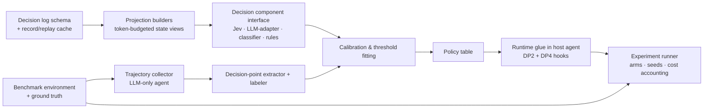
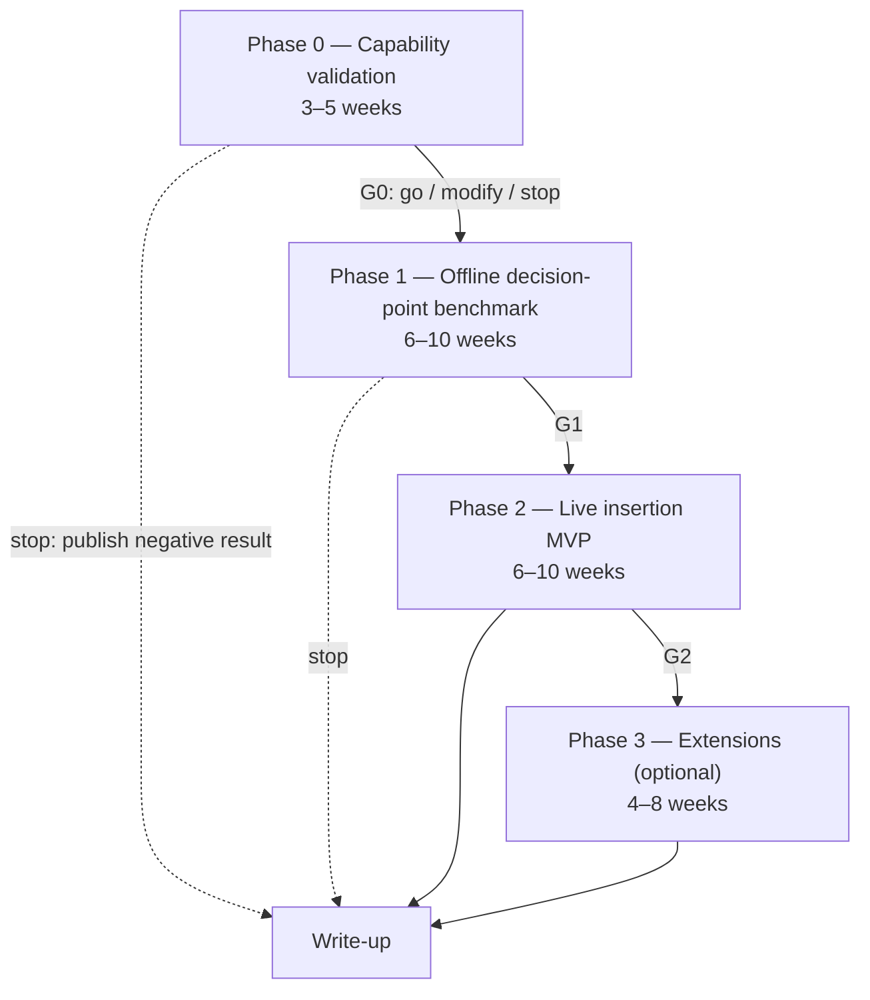

# IMPLEMENTATION_PLAN.md — Roadmap (Plan, Not Implementation)

**Status:** Plan only. Nothing here has been built, run, or measured. All experiments are **future work**; any number that looks like a result is a *target* or a *pre-registered threshold*, never an outcome.

**Companion documents:** [RESEARCH.md](RESEARCH.md) (evidence and research gate) · [ARCHITECTURE.md](ARCHITECTURE.md) (design and decision points DP1–DP7) · [DECISION_LOG.md](DECISION_LOG.md) (assumptions, decisions, kill criteria).

**Question this document answers:** *If I decide to build this, what should I do, in what order, and how will I know whether it is working?*

---

## 1. Recommended initial scope

The research gate in [RESEARCH.md §8](RESEARCH.md#8-research-gate-assessment) is **MODIFY**. The original idea (a general-purpose Jev × LLM agent framework) is replaced by a narrower, evidence-first project:

> **Build a decision-point evaluation harness that instruments an existing LLM agent, replays and labels its bounded decisions, and measures, under controlled conditions, whether a calibrated decision model (Jev, or any drop-in alternative) inserted at those points improves cost per successful task without lowering reliability.**

What this **is**: an evaluation instrument plus the minimum runtime glue to run a live agent with pluggable decision components at two decision points (DP2 tool pre-selection, DP4 progress monitoring; see [ARCHITECTURE.md §3](ARCHITECTURE.md#3-decision-point-taxonomy)).

What this **is not**: a framework, a planner, a new tool protocol, a Jev wrapper library, or a security product. If Phase 2 shows a real, attributable benefit, a thin library can be extracted later; that is a decision for then ([DECISION_LOG.md](DECISION_LOG.md) D9).

Why this scope is technically substantial for an undergraduate infrastructure project: it requires agent instrumentation, trajectory replay, calibration analysis (ECE, reliability, conformal-style thresholds), controlled multi-arm experiments with cost accounting, and reproducible logging. The ecosystem currently has plumbing (LangChain and Pydantic AI integrations) but almost no controlled evidence ([RESEARCH.md §5.4](RESEARCH.md#54-what-already-exists-specifically-for-jev-in-agents)); the evidence is the contribution.

---

## 2. Prerequisites and dependencies

| Prerequisite | Why needed | Status / risk |
|---|---|---|
| Jev API access: TypeSafe console key **or** Vercel AI Gateway (`typesafe-ai/jev`) | Decision component under test | Early access; gateway path documented ([Vercel changelog](https://vercel.com/changelog/typesafe-ai-jev-now-available-on-ai-gateway)). Rate limits adjust dynamically ([Models](https://docs.typesafe.ai/models)). |
| One LLM provider with tool calling and, ideally, option logprobs | Reasoning component and same-interface baseline | Logprob availability differs by provider; the MIT [system-one-adapter](https://github.com/typesafe-ai/system-one-adapter-python) gives a provider-agnostic typed-question baseline. |
| A tool-use agent benchmark with ground-truth outcomes | Labels for DP2/DP4 and end-to-end success | Candidates in §8.1; final choice is unresolved decision U1 ([ARCHITECTURE.md §13](ARCHITECTURE.md#13-unresolved-decisions)). |
| Labeling budget: a few hundred human labels for ambiguous decision points | Calibration fitting and error analysis | Assumption A3 ([ARCHITECTURE.md §12](ARCHITECTURE.md#12-design-assumptions)). |
| Skills: Python or TypeScript, statistics (bootstrap CIs, calibration), basic agent scaffolding | — | Learnable during Phase 0. |
| Budget: tens of dollars for Jev, low hundreds to ~1,500 USD for LLM arms (§11) | Multi-seed, multi-arm runs | LLM arms dominate cost. |

**Dependency order (build what has the fewest dependencies first):**

---

## 3. Phase overview

Each gate (G0, G1, G2) has pre-registered criteria in §10 and [DECISION_LOG.md §8–9](DECISION_LOG.md#8-evidence-that-would-support-continuing). Gates can return **modify** (change decision point, component, or benchmark) as well as go/stop.

---

## 4. Phase 0 — Capability validation (3–5 weeks)

**Goal:** Verify, on data the project controls, the specific Jev behaviors the design depends on. Nothing in Phase 0 requires an agent loop.

| Task | Description | Traces to | Deliverable |
|---|---|---|---|
| T0.1 | Obtain API access (direct or gateway); record model version returned in responses; confirm pricing and rate limits as billed. | [RESEARCH.md §4.1](RESEARCH.md#41-identity-access-and-pricing) | Access notes; pinned model ID. |
| T0.2 | Build the **record/replay cache** for all model calls (Jev and LLM) keyed by request hash, storing model version, latency, tokens, cost. | [ARCHITECTURE.md §4.2](ARCHITECTURE.md#42-component-responsibilities) (decision log) | Cache design note; deterministic offline re-runs. Consider reusing the file format of [jevassert](https://github.com/dtduc-git/jevassert). |
| T0.3 | **Tool-catalog Choice probe.** Construct a catalog of 50–200 tool names with contrastive descriptions and distractors; write 150–300 requests with a known correct tool (hand-labeled). Measure Jev top-1/top-3 accuracy, max-probability calibration (ECE, reliability table, coverage at 0.9), latency p50/p95 at concurrency 1/4/8. Repeat with the LLM-adapter baseline over the same options. | DP2 in [ARCHITECTURE.md §3](ARCHITECTURE.md#3-decision-point-taxonomy); [RESEARCH.md §4.3](RESEARCH.md#43-calibration-evidence) | Report with tables and reliability diagrams. |
| T0.4 | **Progress-monitoring Noul probe.** From 100–200 short synthetic or public trajectories with known end states, ask "is the task complete?", "is the agent repeating a failed action?", "does the last action serve the current sub-goal?". Measure accuracy, ECE, and sensitivity to projection length (last 3 vs last 10 actions). | DP4; context-rot finding [RESEARCH.md §4.4](RESEARCH.md#44-documented-limitations) | Report; recommended projection size. |
| T0.5 | **Wording and order sensitivity.** Re-ask T0.3/T0.4 questions with 3 wordings and 3 option orders; measure label flips and probability shifts. | [RESEARCH.md §4.4](RESEARCH.md#44-documented-limitations) (structural invariants, option order) | Sensitivity table; frozen wording for later phases. |
| T0.6 | **Recalibration probe.** Fit temperature and isotonic calibrators on half of T0.3/T0.4 labels; evaluate ECE on the other half; compare max-probability vs the `confidence` field as gating statistic. | [ARCHITECTURE.md §6.2](ARCHITECTURE.md#62-confidence-gated-handling); [Jev-Calibration](https://github.com/AnthusAI/Jev-Calibration), [jev-ood-calibration](https://github.com/scienthoon/jev-ood-calibration) | Calibrator choice and required label count. |
| T0.7 | **Benchmark selection (resolve U1).** Inspect candidate benchmarks (§8.1) for tool-catalog size, ground-truth availability, cost per run, and contamination risk; pick one. | [ARCHITECTURE.md §13](ARCHITECTURE.md#13-unresolved-decisions) U1 | Decision record in [DECISION_LOG.md](DECISION_LOG.md). |
| T0.8 | Write the **pre-registration** for Phase 2: arms, metrics, thresholds, seeds, analysis plan; hash-pin it (as [jev-baselines-eval](https://github.com/ickma2311/jev-baselines-eval) does). | §10 | Pre-registration document. |

**Gate G0 (pre-registered proposal, adjust before running, never after):**

- **GO** if, on the project's own labeled probes: Jev top-1 accuracy on DP2 is within 5 points of the LLM-adapter baseline (or better); recalibrated ECE ≤ 0.05 on held-out labels for the chosen gating statistic; p95 latency ≤ 1.5 s at concurrency 4; and coverage at the accuracy target chosen for the task is ≥ 50% (i.e., at least half of decisions could be automated at that precision).
- **MODIFY** if accuracy is competitive but calibration is not (→ use Jev only as an extreme-band filter, per [Aman Kumar's finding](https://amankumar.ai/blogs/jev-measured)), or if DP2 fails but DP4 passes (→ change the MVP decision point), or if latency fails only at concurrency > 4 (→ cap concurrency).
- **STOP the Jev path** (keep the harness, publish the negative result) if Jev is more than 10 points below the LLM-adapter baseline on DP2 *and* DP4 after question decomposition, or if API access/pricing becomes unavailable and no drop-in alternative (Laya, LLM-adapter) is acceptable for the research question.

---

## 5. Phase 1 — Offline decision-point benchmark (6–10 weeks)

**Goal:** Produce a labeled dataset of real agent decision points and compare decision components offline, without confounding from the live loop.

| Task | Description | Traces to | Deliverable |
|---|---|---|---|
| T1.1 | Run the **LLM-only agent** on the chosen benchmark (all tasks, ≥ 3 seeds), logging full trajectories: state before each step, tool catalog exposed, tool chosen, arguments, result, final outcome. | [ARCHITECTURE.md §5](ARCHITECTURE.md#5-agent-lifecycle-and-data-flow) | Trajectory corpus + baseline pass^k and cost. |
| T1.2 | **Decision-point extraction.** For each step, derive DP2 instances (state projection → correct next tool, from the benchmark's expected action sequence or from successful trajectories) and DP4 instances (is task done / is agent stuck, from eventual outcome and repeated-action detection). | DP2, DP4 | Decision dataset with provenance. |
| T1.3 | **Human labeling** of ambiguous instances (target: 200–500), with two labelers and agreement statistics. | Assumption A3 | Labeled subset; inter-annotator agreement. |
| T1.4 | **Component comparison** on the decision dataset: Jev; LLM via system-one-adapter (same typed questions); LLM native tool choice (from T1.1 logs); LLM with option logprobs if available; a fine-tuned small encoder trained on a disjoint split; Laya (open weights) if runnable; deterministic rules where applicable. | [ARCHITECTURE.md §4.1](ARCHITECTURE.md#41-component-diagram) (pluggable component) | Comparison report. |
| T1.5 | **Metrics per component:** accuracy; ECE with noise floor and reliability table; AUROC of confidence for error ranking; coverage at fixed precision (e.g., 95%); latency p50/p95; cost per 1,000 decisions; stability across 3 repeated calls. | [RESEARCH.md §9](RESEARCH.md#9-evaluation-methodology) | Metrics tables with bootstrap CIs. |
| T1.6 | **Cascade simulation.** For each component, simulate "act if confident, else defer to the LLM's own choice" and compute escalation rate needed to reach the LLM-only accuracy (as in [jev-baselines-eval](https://github.com/ickma2311/jev-baselines-eval)). | DP7 | Escalation-vs-accuracy curves. |
| T1.7 | **Failure analysis.** Categorize errors: distractor tools, long state, wording, unknowable from projection, adversarial content. | [RESEARCH.md §4.4](RESEARCH.md#44-documented-limitations) | Error taxonomy with examples. |

**Gate G1:** proceed to live insertion only if at least one decision point shows, offline, a component that is (a) within the accuracy tolerance of the LLM's own decisions and (b) has usable calibration (coverage ≥ 50% at the target precision after recalibration) and (c) is at least 3× cheaper per decision than the LLM's decision-equivalent tokens. If only the fine-tuned encoder passes, Phase 2 proceeds with the encoder as the decision component and Jev becomes a secondary arm; the research question does not require Jev specifically.

---

## 6. Phase 2 — Live insertion MVP (6–10 weeks)

**Goal:** Measure end-to-end effects of inserting the decision component at DP2 and DP4 in the live agent loop, under matched budgets and pre-registered analysis.

### 6.1 MVP definition

| Element | Definition |
|---|---|
| Target user | Developers of tool-rich LLM agents (many tools, long loops) who need cheaper, more inspectable per-step decisions; and researchers studying decision/reasoning separation. |
| Core hypothesis (H2 in [DECISION_LOG.md](DECISION_LOG.md)) | Inserting a calibrated bounded-decision component at DP2 and DP4 reduces cost per successful task and/or steps per task **without** reducing pass^k, relative to an LLM-only agent at matched budgets. |
| Why this use case | Closed option sets (fits Choice ≤ 255 **[DOC]**); ground truth available; prior art exists but is unpublished or small ([jev-eval-agent](https://github.com/vinilana/jev-eval-agent) has 6 tasks); the "cheap enough to ask every step" property is exactly what the vendor claims and what no independent study has tested end-to-end. |
| Minimum components | Host agent (existing framework) · projection builders · decision component interface with two implementations (Jev, LLM-adapter) · policy table with fitted thresholds · DP2 hook (narrow exposed tools) · DP4 hook (done/stuck → verifier or re-plan) · decision log · experiment runner with cost accounting. |
| Jev–LLM interaction | Per iteration: one Jev request for DP4 (+ DP5 if included), one for DP2 over the permission-filtered catalog; LLM receives narrowed tools and generates arguments; disagreements logged, LLM proceeds within permissions ([ARCHITECTURE.md §6.3](ARCHITECTURE.md#63-disagreement-handling)). |
| Runtime manages | State, projections, budgets (steps, cost, time), tool execution and validation, deterministic completion verification, logging, fallbacks. |
| Failure handling | Complete-without-Jev principle: any Jev failure or low confidence falls back to the LLM-only path for that decision; runs record which path was taken ([ARCHITECTURE.md §9](ARCHITECTURE.md#9-error-handling-uncertainty-and-fallbacks)). |
| Explicit exclusions | DP3 risk gating as an authority (measured only in shadow mode if at all, U3) · DP5 context pruning (Phase 3) · model-tier routing DP7 (Phase 3) · multi-agent · long-term memory · UI · browser domain. |

### 6.2 Experimental arms

| Arm | Decision component at DP2/DP4 | Purpose |
|---|---|---|
| A0 | None (LLM-only, full catalog, LLM self-reports done) | Baseline |
| A1 | Jev | Treatment |
| A2 | LLM via system-one-adapter (same typed questions, same projections) | Isolates "typed decision at this point" from "Jev specifically" |
| A3 | Fine-tuned small encoder from Phase 1 (if it passed G1) | Isolates zero-shot vs trained |
| A4 | Oracle decisions from ground truth | Upper bound on what perfect decisions could yield |
| A5 | Random / uniform decisions with the same policy table | Control for structure of the intervention |
| A6 | A0 with matched extra budget (e.g., higher reasoning effort or self-consistency costing the same as A1's Jev calls) | Controls for "more compute helps" |
| A7 | A1 with confidence gating disabled (always act on Jev's top choice) | Ablation of calibration |

### 6.3 Metrics (all arms, all seeds)

| Metric | Definition | Why |
|---|---|---|
| pass^k (k = 1, 4, 8) | Task succeeds in all k trials | Reliability, not just capability ([τ-bench](https://arxiv.org/abs/2406.12045)) |
| Cost per successful task | Total USD including Jev tokens and all LLM tokens ÷ successes | The economic claim |
| End-to-end latency | Wall-clock per task, p50/p95 | Includes decision-component latency and network |
| Steps and tool calls per task; extra/distractor calls | From logs | Efficiency mechanism |
| Decision accuracy (DP2, DP4) in the live loop | vs ground truth | Links offline to online |
| Tool-call validity | Schema-valid and permitted calls ÷ total | Safety/validity |
| Escalation rate | Decisions routed to fallback or human | Automation coverage |
| Failure recovery | Recovery rate after a wrong tool or tool error | Robustness |
| Calibration along the trajectory | ECE per step index or checkpoint | Step ≠ trajectory calibration ([UQ taxonomy](https://arxiv.org/abs/2609.07395)) |

**Gate G2 / success criterion (pre-registered proposal):** A1 is judged useful if, with 95% bootstrap CIs, it lowers cost per successful task by ≥ 25% **or** steps per task by ≥ 20% **while** pass^4 is not lower than A0 by more than 2 points, **and** A1 outperforms A5 and is not dominated by A6. If A2 matches A1, the finding is "typed decision points help; Jev's contribution is cost/latency only." If A4 shows no gain, the decision points chosen do not matter in this benchmark and the project should change decision point or benchmark before concluding anything about Jev.

---

## 7. Phase 3 — Extensions (optional, 4–8 weeks)

Pursue only after G2, in this order of expected value:

1. **DP7 per-step model-tier routing** (fast vs strong LLM) with confidence-triggered escalation; compare to query-level routers (RouteLLM-style) and fixed-effort baselines. Motivated by findings that higher reasoning effort can reduce agent accuracy ([HAL](https://arxiv.org/abs/2510.11977)).
2. **DP5 observation triage and context pruning**, measuring accuracy and cost of pruning tool history vs summarization (community tools exist; no controlled evidence).
3. **Browser Jev-first track** replicating a subset of [fastbrowse](https://github.com/agent-labs-dev/fastbrowse)'s comparison with third-party grading.
4. **Write-up**: workshop paper on the research question in [RESEARCH.md §10](RESEARCH.md#10-broader-research-opportunity).

---

## 8. Evaluation setup

### 8.1 Benchmark candidates (resolve in T0.7)

| Candidate | Fit for DP2 | Fit for DP4 | Concerns |
|---|---|---|---|
| τ²-bench (retail, airline, telecom) ([paper](https://arxiv.org/abs/2506.07982), [repo](https://github.com/sierra-research/tau2-bench)) | Native catalogs are small (≈10–20 tools); DP2 needs an **enlarged catalog** (merge domains, add distractors) | Good: final database state defines success | User simulator adds variance; document exactly how catalogs were enlarged |
| BFCL v3 multi-turn ([leaderboard](https://gorilla.cs.berkeley.edu/leaderboard.html)) | Good: many functions, "missing function" category | Weaker: less notion of task completion | Function-calling focus; check contamination |
| Purpose-built mocked catalog (100+ tools with deterministic world), as in [jev-eval-agent](https://github.com/vinilana/jev-eval-agent) | Excellent control of distractors | Good: known ideal paths | Synthetic; must justify realism; reuse and extend rather than duplicate |
| SWE-bench Verified | — | — | Not recommended: contamination and flawed tests documented ([Epoch review](https://epoch.ai/benchmarks/swe-bench-verified/review)); tool catalogs small |

Recommendation to test first: τ²-bench with an enlarged, distractor-rich catalog for realism, plus the mocked catalog for controlled DP2 stress tests. Final decision recorded in [DECISION_LOG.md](DECISION_LOG.md).

### 8.2 Controls (adopted from the evaluation literature; see [RESEARCH.md §9](RESEARCH.md#9-evaluation-methodology))

- Same LLM, same prompts, same tool catalog, same budgets across arms; only the decision component varies.
- Cost accounting includes **every** call, including Jev and fallback calls.
- Thresholds fitted on a calibration split disjoint from test; pre-registered and hash-pinned.
- ≥ 3 seeds; report bootstrap 95% CIs; report pass^k not just pass@1.
- Pin model versions (Jev explicit version, LLM snapshot), temperature, scaffold; record the `model` field of every response.
- Inspect logs for shortcuts; release logs with the write-up.
- Use only public or synthetic task data (Jev data handling: [Models](https://docs.typesafe.ai/models), [Legal](https://docs.typesafe.ai/legal)).

### 8.3 Reproducibility requirements

- Record/replay cache committed with the results (as TypeSafe's cookbooks and several independent repos do).
- Raw per-decision JSONL, pre-registration hash, environment lockfile, and exact catalog versions.
- A single command regenerates every table from the cache without API calls.

---

## 9. Testing strategy for the harness itself

| Layer | What is tested | How |
|---|---|---|
| Projection builders | Token budget never exceeds the 32k state limit; secrets redacted; deterministic output for the same state | Unit tests with synthetic states; property test on token counts |
| Decision component interface | All implementations return the same typed answer shape; probabilities sum to 1; unavailable component raises a typed error | Contract tests; replay fixtures per implementation |
| Policy table | Band lookup is total (every confidence maps to a band); high-risk authority never depends on confidence alone | Table-driven tests; adversarial cases |
| Calibrators | Refit reproduces stored parameters; monotonicity of isotonic map | Unit tests on saved label sets |
| Runtime hooks | Fallback path taken on 429/529/timeout; loop cap enforced; no side effect without validation | Fault-injection tests with a fake decision component |
| Regression per model version | Accuracy/ECE/cost gates on recorded decision packs | jevassert-style gates in CI, re-run when the `model` field changes |
| End-to-end | One benchmark task runs in each arm from cache | Smoke test |

---

## 10. Technical risks

| Risk | Likelihood | Impact | Mitigation | Trigger to act |
|---|---|---|---|---|
| Jev accuracy on real catalogs below usable level | Medium | High | Two-stage selection; contrastive descriptions; encoder arm as alternative | G0/G1 thresholds |
| Calibration not usable after recalibration | Medium | High | Use only extreme bands (filter mode); report as finding | T0.6 |
| API access, pricing, or rate limits change | Medium | Medium | Cache everything; gateway path; drop-in alternatives (LLM-adapter, Laya) | Any 429 storm or pricing change |
| Model version drift mid-study | Medium | High | Pin explicit version; assert on `model` field; freeze thresholds per version | Version string changes |
| Per-step overhead erases gains | Medium | High | Batch questions per request; cap concurrency; drop DP5 first | Latency p95 > 1.5 s |
| Ground truth for DP4 is noisy | High | Medium | Derive from final outcomes plus repeated-action detection; human labels on ambiguous subset | Inter-annotator agreement < 0.7 |
| Benchmark contamination or gaming | Medium | Medium | Log inspection; prefer τ²-bench/BFCL; run the ABC checklist ([ABC](https://arxiv.org/abs/2507.02825)) | Unexplained success spikes |
| Attributing gains to Jev when they come from structure | High | High | Arms A2, A5, A6, A7 exist precisely for this | Analysis plan |
| Scope creep into a framework | High | Medium | Non-goals in [ARCHITECTURE.md §2](ARCHITECTURE.md#2-design-goals-and-non-goals); D9 in decision log | Any new abstraction not needed by an arm |

---

## 11. Effort and cost estimates (with assumptions)

Assumptions: one undergraduate working 10–15 hours/week; Python or TypeScript familiarity; no prior calibration experience; API access obtained within two weeks.

| Phase | Calendar | Effort (hours) | API cost (USD) | Dominant cost |
|---|---|---|---|---|
| 0 Capability validation | 3–5 weeks | 40–75 | 5–30 | LLM-adapter baseline calls; Jev is cents |
| 1 Offline benchmark | 6–10 weeks | 80–150 | 100–500 | LLM-only trajectory collection (≥ 3 seeds) |
| 2 Live MVP | 6–10 weeks | 80–150 | 200–1,500 | 7 arms × seeds × tasks of LLM calls |
| 3 Extensions | 4–8 weeks | 50–100 | 100–800 | Additional arms |
| Write-up | 2–4 weeks | 30–50 | 0 | — |
| **Total (Phases 0–2 + write-up)** | **17–29 weeks** | **230–425** | **~300–2,000** | — |

Jev cost illustration (not a measurement): at the documented $0.042 per million input tokens with free output ([Models](https://docs.typesafe.ai/models)), 20,000 decisions averaging 1,500 input tokens would cost about $1.26. LLM arms dominate every budget line.

---

## 12. Criteria for expanding, changing direction, or stopping

| Signal | Action |
|---|---|
| G0 GO, G1 GO, G2 success with A1 > A2 | Expand: Phase 3; extract a thin decision-layer library; write paper |
| G2 success with A1 ≈ A2 | Change direction: the contribution is "typed decision points", component-agnostic; keep Jev as the cheap option, reframe |
| G2 success only for A3 (trained encoder) | Change direction: task-specific classifiers; Jev's value is bootstrapping labels cheaply |
| A4 (oracle) shows no gain | Change decision point or benchmark before drawing conclusions |
| G0 or G1 STOP conditions | Stop the Jev path; publish harness and negative result |
| Access/pricing loss with no substitute | Pause; the harness remains reusable |

Full kill/continue criteria: [DECISION_LOG.md §8–9](DECISION_LOG.md#8-evidence-that-would-support-continuing).

---

## 13. Research experiments vs engineering work

| Research experiments (produce evidence; may be negative) | Engineering work (produce artifacts) |
|---|---|
| T0.3–T0.6 capability and calibration probes | T0.2 record/replay cache |
| T1.4–T1.7 component comparison, cascade simulation, failure analysis | T1.1 instrumentation of the host agent; T1.2 extractor |
| Phase 2 arms A0–A7 and analysis | Projection builders, policy table, hooks, experiment runner |
| Phase 3 routing and pruning studies | Optional thin library (only after G2) |

---

## 14. Traceability matrix

| Task | Architecture section | Diagram | Research finding | Decision log |
|---|---|---|---|---|
| T0.1 | §4.2 | §4.1 component diagram | RESEARCH §4.1 identity/pricing | D1, R3 |
| T0.2 | §4.2 decision log | §7.1 state diagram | RESEARCH §9 reproducibility | D6 |
| T0.3 | §3 DP2, §8 tool interface | §5.1 loop | RESEARCH §4.3, §5.4 (skill suggestion, jev-eval-agent) | H1, Q1 |
| T0.4 | §3 DP4 | §5.1 loop | RESEARCH §4.4 context rot | H3, Q2 |
| T0.5 | §9 option-order row | — | RESEARCH §4.4 structural invariants | Q3 |
| T0.6 | §6.2 | §6.2 gating flow | RESEARCH §4.3 calibration studies | H4, D4 |
| T0.7 | §13 U1 | — | RESEARCH §9 benchmarks | D5 |
| T0.8 | — | — | RESEARCH §9 controls | D6 |
| T1.1–T1.3 | §5, §7 | §5.1, §7.1 | RESEARCH §9 | A3 |
| T1.4–T1.6 | §4.1 pluggable component, §6.1 policy | §4.1 | RESEARCH §6 Q3–Q5, §5 | H1, H2, D3 |
| T1.7 | §9 | — | RESEARCH §4.4 | R1 |
| Phase 2 arms | §4, §5, §6 | all | RESEARCH §6, §9 | H2, G2 |
| Phase 3 | §11 B, DP5, DP7 | §11 | RESEARCH §7, §10 | D9 |
