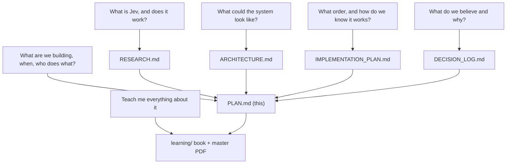
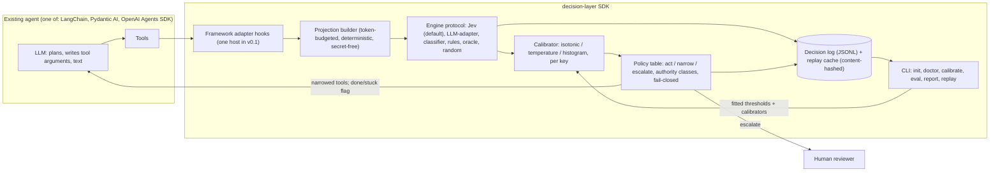
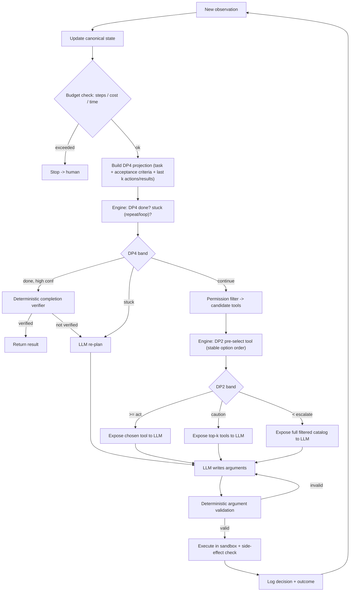
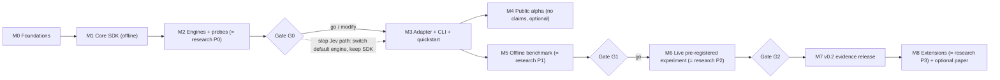
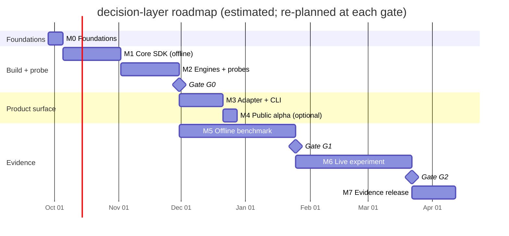

# PLAN.md — decision-layer: Operational Master Plan

**Status:** ACTIVE. This is the single operational source of truth for building the product. It stitches together the four research documents and turns them into a dated, trackable plan.

**Last updated:** 2026-09-27. **Current milestone:** M0 (Foundations). **Next gate:** G0 (end of M2). **Plan start:** 2026-09-28.

**Companion documents (frozen research record):** [RESEARCH.md](RESEARCH.md) (evidence and research gate) · [ARCHITECTURE.md](ARCHITECTURE.md) (system design, decision points DP1-DP7) · [IMPLEMENTATION_PLAN.md](IMPLEMENTATION_PLAN.md) (phased research roadmap) · [DECISION_LOG.md](DECISION_LOG.md) (living register of decisions, assumptions, risks).

**Design doc for this product decision:** `~/.gstack/projects/jev/shrijacked-main-design-20260927-033935.md` (office-hours, Builder mode, APPROVED; independent 3-round spec review 7->8->8/10).

---

## 1. How to read this document

**Question this document answers:** *What are we building, in what order, how will we know each step works, and what needs a human?*

### 1.1 Relationship to the four research docs

The three research docs (RESEARCH, ARCHITECTURE, IMPLEMENTATION_PLAN) are **frozen**: they are the historical research record and are not edited. DECISION_LOG is a **living register** and takes new dated rows only. PLAN.md does **not** duplicate IMPLEMENTATION_PLAN.md; it re-expresses the same phases as product **milestones** and adds the product-only work (packaging, CLI, adapters, a learning book) that the research roadmap never had.

| Doc | Frozen? | Answers |
|---|---|---|
| [RESEARCH.md](RESEARCH.md) | Yes | What Jev is, what the evidence says, why the gate is MODIFY. |
| [ARCHITECTURE.md](ARCHITECTURE.md) | Yes | What the system could look like and why (DP taxonomy, policy table, projections). |
| [IMPLEMENTATION_PLAN.md](IMPLEMENTATION_PLAN.md) | Yes | The phased research roadmap (P0-P3, tasks T0.x/T1.x, gates). |
| [DECISION_LOG.md](DECISION_LOG.md) | No (append-only) | What we believe and why; decisions D1-Dn, assumptions, risks, open questions. |
| **PLAN.md** (this) | No (living) | The operational product plan: milestones, dated tasks, done-criteria, ownership. |

### 1.2 ID naming convention (fixes the doc-to-doc ID collisions; see §15)

The four docs reuse the same letters for different things (A1-A7 is both design assumptions and experiment arms; G1-G2 is both design goals and gates; R1-R5 is both assumptions and risks). PLAN.md uses **prefixed IDs** so nothing is ambiguous, without renaming anything in the frozen docs:

| Prefix | Meaning | Source |
|---|---|---|
| `M0`..`M8` | Product milestone | new (this doc) |
| `PT-*` | Product task (inside a milestone) | new (this doc) |
| `T0.x`, `T1.x` | Research task | [IMPLEMENTATION_PLAN.md](IMPLEMENTATION_PLAN.md) |
| `G0`, `G1`, `G2` | Gate (go / modify / stop checkpoint) | [IMPLEMENTATION_PLAN.md](IMPLEMENTATION_PLAN.md) §4-6 |
| `GOAL-1`..`GOAL-6` | Design goal (was G1-G6) | [ARCHITECTURE.md](ARCHITECTURE.md) §2 |
| `DP1`..`DP7` | Decision point | [ARCHITECTURE.md](ARCHITECTURE.md) §3 |
| `ARM-A0`..`ARM-A7` | Experiment arm (was A0-A7) | [IMPLEMENTATION_PLAN.md](IMPLEMENTATION_PLAN.md) §6.2 |
| `ASM-A1`..`ASM-A7` | Design assumption (was A1-A7) | [ARCHITECTURE.md](ARCHITECTURE.md) §12 |
| `H0`..`H5` | Hypothesis | [DECISION_LOG.md](DECISION_LOG.md) §1 |
| `D1`..`Dn` | Decision | [DECISION_LOG.md](DECISION_LOG.md) §3 |
| `Q1`..`Qn` | Open question | [DECISION_LOG.md](DECISION_LOG.md) §6 |
| `U1`..`U6` | Unresolved design decision | [ARCHITECTURE.md](ARCHITECTURE.md) §13 |
| `RISK-*` | Risk | this doc §12 (+ [DECISION_LOG.md](DECISION_LOG.md) §7) |
| `H1`..`H8` (touchpoints) | Human touchpoint | this doc §10 — always written "touchpoint H1" to avoid clashing with hypothesis H1 |
| `EF-*` | Engineering finding from the plan review | this doc §7.3 |
| `LB-*` | Learning-book chapter | [learning/](../learning/) |

Evidence labels, used everywhere: **[DOC]** official docs · **[IND]** independent measurement · **[VENDOR]** vendor claim · **[HYP]** our hypothesis · **[MEASURED]** measured by us (with a run ID; none exist yet).

---

## 2. What we are building

An **open-source Python SDK ("decision-layer")** that adds typed, calibrated decision points to an LLM agent a developer already runs (LangChain, Pydantic AI, or the OpenAI Agents SDK).

At each decision point:
1. The runtime builds a small, token-budgeted **projection** of the agent's state.
2. A cheap, **swappable engine** (Jev by default) answers a bounded typed question (Choice / Score / Noul) and returns probabilities.
3. A **deterministic policy** reads the probability (recalibrated) and does one of three things: **act** on the answer, **narrow** the LLM's options, or **escalate** to the LLM or a human.
4. Every decision and its eventual outcome are **logged** so thresholds can be fitted and results reproduced.

It ships a CLI (`calibrate`, `eval`, `report`, `replay`, plus `init` and `doctor`) that fits thresholds from the user's own logs and measures **cost per successful task**.

### 2.1 Two co-equal deliverables (elevated after the plan review)

The independent CEO review made a sharp point: the research's own conclusion ([RESEARCH.md §5.5](RESEARCH.md#55-overlap-difference-reuse-and-framework-vs-plugin), [§10](RESEARCH.md#10-broader-research-opportunity)) is that the scarce, defensible asset is **controlled evidence with trajectory-level calibration**, not another integration (LangChain, Pydantic AI, Vercel already ship Jev integrations; ~200 community projects exist). We keep the SDK as the product (locked decision D11) but **elevate the evidence artifact to a co-headline deliverable**, because the SDK's credibility depends on it and it is what no one else has published:

- **Deliverable A — the SDK** (the instrument developers install).
- **Deliverable B — the evidence** (a pre-registered, reproducible study with proper baselines and **trajectory-checkpoint calibration**, plus the released decision dataset and a one-command results page).

The SDK is the instrument; the evidence is the moat. Neither ships a performance claim before its gate. This is the synthesis of the user's product decision and the review's strategic challenge; the full challenge is recorded for the user's call in §11 (Q17) and §12 (RISK-P4).

### 2.2 Revised premises (from the design doc, Builder mode)

| # | Premise | Status |
|---|---|---|
| P1 | Follow the MODIFY gate in **product** form: a decision layer plus evaluation tooling, not a new agent runtime. | Accepted (revised from research-only at the user's request). |
| P2 | Jev is one **swappable** engine; the SDK works and produces valid results without it. | Accepted (locked). |
| P3 | **Evidence before claims**, with gates G0/G1/G2; an honest negative result is a successful outcome. | Accepted (locked). |
| P4 | **PLAN.md is the operational source of truth**; the three research docs are frozen; DECISION_LOG takes dated amendments. | Accepted (locked). |

### 2.3 Non-goals (unchanged from the research; N1 still holds)

| # | Non-goal | Why |
|---|---|---|
| N1 | A new general-purpose agent framework or tool protocol. | Frameworks exist and two already integrate Jev ([ARCHITECTURE.md §2](ARCHITECTURE.md#2-design-goals-and-non-goals)). The SDK is a *layer* that plugs in; to stay clear of N1 in practice, v0.1/v0.2 are limited to DP2+DP4 on one host framework, cross-framework adapters deferred to M8. |
| N2 | Jev for planning, argument/text generation, or multi-hop reasoning. | Documented weakness [DOC]. The LLM keeps these. |
| N3 | Jev as the sole authorization or security boundary. | Adversarial content is a documented weakness [DOC]; enforced by code (§7.3 EF-15/EF-16). |
| N4 | "Jev-first" (Jev drives the whole loop) as the default. | Only viable where the action space is enumerable ([ARCHITECTURE.md §11 B](ARCHITECTURE.md#b-jev-first-jev-selects-the-next-action-llm-only-when-needed)); optional browser track at M8. |
| N5 | Multi-agent orchestration, long-term memory, UI. | Out of MVP scope. |

---

## 3. Document map (which doc answers which question)



---

## 4. Product architecture

This extends the recommended architecture in [ARCHITECTURE.md §4](ARCHITECTURE.md#4-recommended-architecture-decision-gated-llm-agent) (Architecture A/E: LLM-first, decision engine advisory) into concrete SDK modules. The decision engine is advisory; deterministic code owns safety, permissions, arithmetic, and verification (design goals GOAL-1..GOAL-6).



### 4.1 Module responsibilities (extends [ARCHITECTURE.md §4.2](ARCHITECTURE.md#42-component-responsibilities))

| Module | Owns | Never does |
|---|---|---|
| Adapter | Hooks into the host framework's pre-tool / pre-model seam; exposes narrowed tools and done/stuck flags. | Add a tool not in the catalog; bypass the permission filter. |
| Projection builder | Deterministic, token-budgeted (<=32k) views per DP; **secret-free by construction** (allow-list by reference, see EF-15). | Send full history; emit raw secrets. |
| Engine protocol | `decide(projection, question) -> TypedAnswer{choice/score/noul, probabilities?, confidence?, model_version}`. Implementations: Jev, LLM-adapter, classifier, rules, oracle, random. | Generate text/arguments; execute anything. |
| Calibrator | Post-hoc map (isotonic / temperature / histogram) keyed by a content hash of the serialized projection template + option order + model version. | Fit on thin data (refuses; see EF-14). |
| Policy table | Deterministic band lookup -> act / narrow / escalate; authority classes; fail-closed on side effects. | Learn thresholds at runtime; let confidence alone authorize a side effect. |
| Decision log + replay cache | Append-only record (inputs hash, options, probabilities, confidence, choice, latency, cost, model version, outcome). Deterministic request hashing. | Store secrets; include wall-clock/counters in the request hash. |
| CLI | `init`, `doctor`, `calibrate`, `eval`, `report`, `replay`. | Publish a performance claim before the gate that produced it. |

---

## 5. The MVP decision loop

The MVP covers **DP2** (tool pre-selection) and **DP4** (done/stuck monitoring) only. **DP3** (risk classification) is measured in shadow mode at most, decided at G0 (open decision U3). **DP5** (observation triage) is deferred to M8. This is the MVP loop (simpler than the full loop in [ARCHITECTURE.md §5.1](ARCHITECTURE.md#51-one-loop-iteration), which also draws DP3/DP5).



Notes: DP4 "done" **never** ends a run on its own; only the deterministic completion verifier (or a human) can. DP4 v1 is scoped to **done + loop/repeat detection**; "drift from goal" is deferred until it has an operational definition (frozen in M2.0; see EF-05). On any engine failure or low confidence, the policy **falls back** and, critically, reconstructs the **full** (non-projected) context for the LLM so the fallback is not handicapped by the lossy projection (EF-04).

---

## 6. Roadmap



### 6.1 Milestone <-> research-phase mapping

| Milestone | Maps to | Ends with | Est. effort (see §13) |
|---|---|---|---|
| M0 Foundations | (new; setup) | this session's docs done | ~1 week (mostly this session) |
| M1 Core SDK (offline) | P0/P1 engineering | green offline test suite, no keys | ~3-4 weeks / 60-90 h |
| M2 Engines + capability probes | P0 exactly (T0.1, T0.3-T0.8) | **G0** | ~3-5 weeks / 40-75 h + API |
| M3 Adapter + CLI + quickstart | (new; product surface; resolves U4) | quickstart <5 min from cache | ~2-3 weeks / 40-60 h |
| M4 Public alpha (no claims) | (new; optional, gated on user) | v0.1 published (optional) | ~1 week / 15-25 h |
| M5 Offline decision benchmark | P1 exactly (T1.1-T1.7) | **G1** | ~6-10 weeks / 80-150 h + API |
| M6 Live experiment | P2 exactly (ARM-A0..A7) | **G2** | ~6-10 weeks / 80-150 h + API |
| M7 v0.2 evidence release | write-up + results page | reproducible results, evidence-backed defaults | ~2-4 weeks / 30-50 h |
| M8 Extensions | P3 | (optional) | 4-8 weeks / 50-100 h |

### 6.2 Estimated calendar (Gantt; dates are estimates, re-planned at each gate)



Calendar estimate to M7: about **20-30 weeks** from 2026-09-28. Most of the time is API runs, human labeling, and gate reviews, not coding.

---

## 7. Master task list

Legend: **Owner** = "AI" (me) or "You" (human touchpoint). **Status** = TODO / DOING / DONE / BLOCKED. Done-criteria say exactly how each task is verified. "Book" links to the learning-book chapter that documents it (LB-*).

### 7.1 M0 — Foundations (this session unless noted)

| ID | Task | Depends | Deliverable | Done-criteria (verification) | Owner | Status | Traceability |
|---|---|---|---|---|---|---|---|
| PT-0.1 | Git baseline | - | repo + `.gitignore`, four docs committed | `git log` shows baseline commit; `.claude/settings.local.json` untracked | AI | DONE | D12 |
| PT-0.2 | Office-hours design doc + spec review | - | design doc in `~/.gstack/projects/jev/` | 3-round independent review converged (7->8->8/10), Status APPROVED | AI | DONE | design doc |
| PT-0.3 | Plan review (autoplan CEO/Eng/DX) | PT-0.2 | review findings folded here | 3 independent reviews done; findings in §7.3, §11, §12; consensus §16.3 | AI | DONE | §16.3 |
| PT-0.4 | Write PLAN.md | PT-0.3 | this file | all 16 sections; ID coverage check passes (§14) | AI | DOING | this doc |
| PT-0.5 | DECISION_LOG amendments | PT-0.4 | D11-D15, Q11-Q17, product risks, changelog | rows present in [DECISION_LOG.md](DECISION_LOG.md); dated 2026-09-27 | AI | DOING | D11-D15 |
| PT-0.6 | Learning book + master PDF | PT-0.4 | `learning/` + `jev-learning-master.pdf` | clean Tectonic build; every page rendered; every figure has a data label | AI | TODO | LB-* |
| PT-0.7 | AGENTS.md working agreement | PT-0.6 | `AGENTS.md` | definition-of-done incl. book update + PDF rebuild; error-message + secrets rules | AI | TODO | §14 |
| PT-0.8 | Python 3.12 via uv + package skeleton | PT-0.7 | `pyproject`, src layout, pytest/ruff/mypy, `make check` | `make check` green on an empty skeleton | AI | TODO (needs touchpoint H3) | D13 |
| PT-0.9 | Secrets policy | PT-0.8 | `.env.example`, redaction/allow-list rule | secret-smuggle test asserts no secret in any projection or log (EF-15) | AI | TODO | N3, EF-15 |

### 7.2 M1-M8 — milestone task list (research tasks carry their T-IDs)

| ID | Task | Depends | Done-criteria | Owner | Traceability |
|---|---|---|---|---|---|
| PT-1.1 | Decision record + JSONL log | PT-0.8 | schema documented; round-trips; append-only | AI | [ARCH §4.2](ARCHITECTURE.md#42-component-responsibilities) |
| PT-1.2 | Record/replay cache (= T0.2), content-hashed | PT-1.1 | hash excludes wall-clock/counters; cross-process stable under randomized `PYTHONHASHSEED` (EF-11) | AI | T0.2, EF-11 |
| PT-1.3 | Typed decision-point spec (Choice/Score/Noul + contrastive criteria + mandatory "none/other") | PT-1.1 | 422-shaped questions rejected; "other" always present | AI | [ARCH §8](ARCHITECTURE.md#8-tool-interface-concepts) |
| PT-1.4 | Projection builders (<=32k, deterministic, secret-free) | PT-1.3 | token budget never exceeded; identical output for identical state; secret-smuggle test passes | AI | [ARCH §7](ARCHITECTURE.md#7-state-and-memory-design), EF-03, EF-15 |
| PT-1.5 | Engine protocol + fake/oracle/random engines | PT-1.3 | contract tests; "confidence unavailable" is a first-class return (EF-12) | AI | D3, EF-12 |
| PT-1.6 | Policy table (both gating statistics; bands; authority classes; fail-closed) | PT-1.5 | band lookup total; side-effect path cannot execute without deterministic gate (property test, EF-16); both max-prob and confidence supported (EF-02) | AI | [ARCH §6](ARCHITECTURE.md#6-model-interaction-and-orchestration-strategy), EF-02, EF-16 |
| PT-1.7 | Calibrators (isotonic/temperature/histogram) + metrics (ECE w/ noise floor, Brier, AUROC, coverage) | PT-1.5 | saturated-1.0 handled (epsilon-clip or histogram; temperature only if logits exist) (EF-13); refuses thin data (EF-14) | AI | T0.6, EF-13, EF-14 |
| PT-1.8 | Fallbacks (fault injection) + full-context reconstruction on fallback | PT-1.6 | fallback fires on 429/529/timeout/malformed/out-of-range; fallback rebuilds full context (EF-04); fallback rate logged | AI | [ARCH §9](ARCHITECTURE.md#9-error-handling-uncertainty-and-fallbacks), EF-04 |
| PT-2.0 | **Freeze G0 criteria** (precision target + DP4 "stuck" definition) | PT-1.8 | written, hash-pinned in the T0.8 pre-registration before any probe is scored | AI+You | EF-05, U3 |
| PT-2.1 | Jev access + version pinning (= T0.1) | PT-2.0, touchpoint H1 | `model` field asserted; pricing/rate limits recorded; whether logits are exposed recorded (EF-13) | You+AI | T0.1, D10 |
| PT-2.2 | JevEngine + LLMAdapterEngine | PT-2.1 | both pass engine contract tests | AI | D3 |
| PT-2.3 | DP2 probe (= T0.3) | PT-2.2 | top-1/top-3, ECE, latency p50/p95 @ concurrency 1/4/8, reliability table | AI | T0.3, Q1 |
| PT-2.4 | DP4 probe (= T0.4) | PT-2.2 | accuracy/ECE vs projection length (3/5/10 actions) | AI | T0.4, Q2 |
| PT-2.5 | Wording/order sensitivity (= T0.5), incl. filtered-subset permutations | PT-2.3 | label-flip and probability-shift table; stable sort key validated (EF-06) | AI | T0.5, Q3, EF-06 |
| PT-2.6 | Recalibration study (= T0.6); resolve gating statistic (U2) | PT-2.3, PT-2.4 | held-out ECE per statistic; U2 resolved | AI | T0.6, D4, U2 |
| PT-2.7 | Benchmark selection (= T0.7); resolve U1 | PT-2.0 | decision recorded in DECISION_LOG | AI+You | T0.7, U1 |
| PT-2.8 | Pre-registration (= T0.8) | PT-2.6, PT-2.7 | hash-pinned arms/metrics/thresholds/seeds | AI | T0.8, D6 |
| PT-2.9 | **Gate G0 report** | PT-2.3..2.8 | go/modify/stop recommendation vs §8 criteria | AI->You | G0 |
| PT-3.1 | Host framework decision (U4) | G0 | one framework chosen; recorded | AI+You | U4, Q12 |
| PT-3.2 | Primary adapter (DP2 narrow + DP4 monitor hooks) | PT-3.1 | works on one example agent; fallback proven end-to-end | AI | [ARCH §4](ARCHITECTURE.md#4-recommended-architecture-decision-gated-llm-agent) |
| PT-3.3 | CLI (`init`, `doctor`, `calibrate`, `eval`, `report`, `replay`) | PT-1.7, PT-3.2 | each has args/defaults per §7.4; `--help` states problem+cause+fix on errors (EF-DX3) | AI | §7.4 |
| PT-3.4 | Offline quickstart + committed demo cache/sample log | PT-3.3 | one documented command runs from a committed synthetic cache, no API key, <5 min after prereqs; CI runs it (EF-DX1, EF-DX2) | AI | EF-DX1, EF-DX2 |
| PT-4.1 | v0.1 packaging, README ("why / when not to use" + comparison table), examples (CI-executed) | PT-3.4 | build installs; examples pass in CI; no performance claims (EF-DX7, EF-DX8) | AI+You | touchpoint H8, EF-DX7 |
| PT-5.1 | LLM-only trajectories (= T1.1), >=3 seeds | G0 | corpus + baseline pass^k + cost | AI | T1.1 |
| PT-5.2 | Decision-point extraction (= T1.2) | PT-5.1 | DP2/DP4 instances with provenance | AI | T1.2 |
| PT-5.3 | Human labeling (= T1.3), 2 labelers | PT-5.2, touchpoint H6 | 200-500 labels; inter-annotator agreement reported | You+AI | T1.3, Q13 |
| PT-5.4 | Component comparison (= T1.4) | PT-5.2 | Jev / LLM-adapter / native / encoder / Laya / rules on the dataset | AI | T1.4, D3 |
| PT-5.5 | Metrics + cascade sim + failure analysis (= T1.5-1.7) | PT-5.4 | tables w/ bootstrap CIs; escalation curves; error taxonomy | AI | T1.5-1.7 |
| PT-5.6 | **Gate G1 report** | PT-5.5 | go/modify/stop vs §8 | AI->You | G1 |
| PT-6.1 | Live hooks + completion verifier + experiment runner | G1 | arms runnable from config; cost accounting per call | AI | [ARCH §5](ARCHITECTURE.md#5-agent-lifecycle-and-data-flow) |
| PT-6.2 | Run ARM-A0..A7, >=3 seeds, pre-registered analysis | PT-6.1, touchpoint H7 | all arms complete; drift guard active (EF-T3) | AI | §9, EF-T3 |
| PT-6.3 | **Trajectory-checkpoint calibration** (deliverable B) | PT-6.2 | checkpoint ECE across runs, not just per-step | AI | [RESEARCH §10](RESEARCH.md#10-broader-research-opportunity), [IMPL §6.3](IMPLEMENTATION_PLAN.md#63-metrics-all-arms-all-seeds) |
| PT-6.4 | **Gate G2 report** | PT-6.2, PT-6.3 | success vs §8; A1 vs A2/A5/A6 verdicts | AI->You | G2 |
| PT-7.1 | v0.2 evidence release: results page (one-command reproduce) + evidence-backed defaults | G2 | `report` regenerates every table from cache with no API calls | AI+You | §8.3 IMPL, touchpoint H8 |
| PT-8.x | Extensions: DP7 routing, DP5 triage, more adapters, browser track, paper | G2 | per-extension criteria (deferred) | AI+You | [IMPL §7](IMPLEMENTATION_PLAN.md#7-phase-3--extensions-optional-48-weeks) |

### 7.3 Engineering findings from the plan review (must be honored; auto-decided via the 6 principles)

These come from the independent engineering review and are baked into the done-criteria above. Each is a design constraint, not optional.

| ID | Finding | Resolution (where) |
|---|---|---|
| EF-01 | Calibration key must track the actual serialized projection, or you gate on a stale calibrator silently. | Calibration key = content hash of serialized projection template + option order + model version; **fall back (not gate)** on key miss. PT-1.2, PT-1.7. |
| EF-02 | M1 must not hardcode the gating statistic that G0 (U2) selects. | Implement both max-prob and confidence, both calibrators, behind an interface; G0 selects. PT-1.6, PT-1.7. |
| EF-03 | Projections must be deterministic and token-budget-safe. | PT-1.4 done-criteria. |
| EF-04 | Fallback that reuses the lossy projection confounds the eval and handicaps A1. | On fallback, reconstruct **full** context for the LLM; A0 and A1-fallback use identical context; log fallback rate. PT-1.8, PT-6.2. |
| EF-05 | DP4 "drift/stuck" has no deterministic oracle. | DP4 v1 = done + loop/repeat detection; "drift" deferred until operationally defined; frozen in PT-2.0. |
| EF-06 | "Fixed option order" is ill-defined under a dynamic permission filter. | Stable total order = sort by tool ID, invariant under filtering; include filtered-subset permutations in PT-2.5. |
| EF-11 | Reproducibility depends on request-hash stability. | Canonical serialization (sorted keys; exclude wall-clock/counters/floats); cross-process hash-stability test with randomized `PYTHONHASHSEED`. PT-1.2. |
| EF-12 | "probabilities sum to 1" contract breaks the LLM-adapter arm (no logprobs). | "confidence unavailable" is a first-class engine return; metrics computed only where probabilities are meaningful. PT-1.5. |
| EF-13 | Temperature scaling is undefined on saturated 1.0 / when the API returns probs not logits. | Verify logits at PT-2.1; if absent, use isotonic/histogram + epsilon-clip and a "saturated" band that always escalates above filter authority. PT-1.7. |
| EF-14 | `calibrate` will cheerfully fit garbage on thin data. | Per-cell sample minimums, CI widths on ECE, conservative (escalate) defaults, refuse to fit below minimum. PT-1.7, PT-3.3. |
| EF-15 | Secret **redaction** (deny-list) is the classic leak pattern. | Allow-list **by reference**: the executor injects secret values at call time; projections/logs never receive raw values; fuzz test smuggles a known token through every projection and asserts absence. PT-0.9, PT-1.4. |
| EF-16 | "Fail-closed on side effects" and "Jev not the authorization boundary" need enforcement, not just design. | Property/state-machine test: no path reaches Execute for a side-effecting call without the deterministic gate; DP outputs may only feed narrow/deny/escalate enums, never allow/elevate. PT-1.6. |
| EF-17 | "decision-equivalent tokens" (G1 denominator) and "cost per successful task" are undefined. | Pre-register the exact cost formula in PT-2.8; validate direction on ARM-A4 (oracle) and ARM-A5 (random). |
| EF-T3 | "Calibrate from your logs" rots silently under distribution drift. | Drift guard (PSI or rolling-sample ECE) with a fail-safe that widens bands/escalates; property test that injected shift triggers it. PT-6.2. |
| EF-DX1 | The <5 min quickstart has no defined command/output. | PT-3.4 specifies the exact command + expected output; CI runs it. |
| EF-DX2 | Offline quickstart needs a demo cache that nothing said ships. | Commit a tiny synthetic replay cache + sample JSONL; quickstart points at it by default. PT-3.4. |
| EF-DX3 | Error messages: no problem+cause+fix requirement. | Definition-of-done in AGENTS.md; tests assert actionable messages on the top failure paths (wrong Python, no cache, thin calibration data, engine unavailable, rate limit). PT-3.3. |
| EF-DX7 | "Why this over the built-in Jev integration?" lives only in an internal doc. | Required README section + comparison table as PT-4.1 done-criteria. |
| EF-DX8 | Single-host adoption cliff (U4 undecided) is invisible. | Resolve U4 before M4; README states the supported framework and "others: M8". PT-3.1, PT-4.1. |

### 7.4 CLI / API surface (fills the DX gap: names, args, defaults)

Illustrative shapes [HYP], finalized at M3. The point is that defaults exist and are written down.

```text
decision-layer init                 # scaffold config + .env.example + sample DP definitions
decision-layer doctor               # check Python >=3.10, keys, cache; print the fix if wrong
decision-layer quickstart           # run the offline demo from the committed cache (no API key)
decision-layer calibrate <log>      # --dp DP2|DP4  --engine jev(default)  --calibrator isotonic(default)
                                    # --target-precision 0.9  --min-samples 200  --out calib.json
decision-layer eval                 # run arms on a benchmark; --arms A0,A1,A2  --seeds 3  --from-cache
decision-layer report <run>         # render a saved eval into tables/figures (no API calls)
decision-layer replay <run>         # re-run from the cache (no API calls); NOT a live re-run
```

Canonical decision-point example (the same one the quickstart and the book use) [HYP]:

```python
from decision_layer import DecisionPoint, Choice, JevEngine, Policy

dp2 = DecisionPoint(
    question=Choice(
        prompt="Which tool best serves the current sub-goal?",
        options=tool_names + ["none_of_the_above"],   # mandatory escape hatch
    ),
    engine=JevEngine(model="jev-1.13.0"),              # swappable: LLMAdapterEngine(...), RulesEngine(...)
    policy=Policy.from_file("calib.json"),             # fitted bands: act / narrow / escalate
)

decision = dp2.decide(projection)                      # typed answer + probabilities + confidence
tools_to_expose = decision.apply()                     # act (1 tool), narrow (top-k), or escalate (all)
```

Engine swap is one line: replace `JevEngine(...)` with `LLMAdapterEngine(provider="...")`, `ClassifierEngine(...)`, or `RulesEngine(...)`.

---

## 8. Gate criteria (pre-registered; adjust before running, never after)

From [IMPLEMENTATION_PLAN.md §4-6](IMPLEMENTATION_PLAN.md#4-phase-0--capability-validation-35-weeks) and [DECISION_LOG.md §8-9](DECISION_LOG.md#8-evidence-that-would-support-continuing), reinterpreted for the product. The precision target inside G0 is frozen in PT-2.0 and locked in the PT-2.8 pre-registration before any probe is scored.

| Gate | GO if | MODIFY if | STOP (Jev path) if |
|---|---|---|---|
| **G0** (end M2) | DP2 top-1 within 5 pts of the LLM-adapter baseline; recalibrated ECE <= 0.05 on the chosen statistic; p95 <= 1.5 s @ concurrency 4; coverage >= 50% at the frozen precision target. | accuracy OK but calibration not (-> Jev as extreme-band filter); DP2 fails but DP4 passes (-> switch MVP DP); latency fails only above concurrency 4 (-> cap concurrency). | Jev > 10 pts below the LLM-adapter on DP2 **and** DP4 after decomposition; or access/pricing lost with no acceptable drop-in. Keep the SDK; switch default engine; publish the negative result. |
| **G1** (end M5) | at least one engine that is within accuracy tolerance of the LLM's own decisions, has usable calibration (coverage >= 50% at target precision after refit), and is >= 3x cheaper per decision than the LLM's decision-equivalent tokens (defined in PT-2.8). | only the trained encoder passes (-> encoder becomes the default engine; Jev a secondary arm). | no engine reaches usable calibration -> reframe to "typed decision points as filters," drop gating claims. |
| **G2** (end M6) | ARM-A1 lowers cost per successful task by >= 25% **or** steps by >= 20% while pass^4 is within 2 pts of ARM-A0, **and** beats ARM-A5 (random) and is not dominated by ARM-A6 (matched compute). | ARM-A2 (LLM same-interface) matches ARM-A1 -> contribution is "typed decision points," Jev is the cost option; reframe. | ARM-A4 (oracle) shows no end-to-end gain -> the chosen decision points are not the bottleneck; change DP or benchmark before concluding. |

Every gate produces a written report (PT-2.9 / PT-5.6 / PT-6.4) and the go/modify/stop call is a human touchpoint (touchpoint H5).

---

## 9. Evaluation protocol (summary)

Full detail: [IMPLEMENTATION_PLAN.md §5-8](IMPLEMENTATION_PLAN.md#5-phase-1--offline-decision-point-benchmark-610-weeks), [RESEARCH.md §9](RESEARCH.md#9-evaluation-methodology).

**Experiment arms** (prefixed to avoid the A1-A7 collision with assumptions):

| Arm | Engine at DP2/DP4 | Purpose |
|---|---|---|
| ARM-A0 | none (LLM-only, full catalog) | baseline |
| ARM-A1 | Jev | treatment |
| ARM-A2 | LLM via system-one-adapter (same typed questions) | isolates "typed decision point" from "Jev specifically" |
| ARM-A3 | fine-tuned encoder (if it passed G1) | isolates zero-shot vs trained |
| ARM-A4 | oracle from ground truth | upper bound |
| ARM-A5 | random with the same policy table | controls for the structure of the intervention |
| ARM-A6 | ARM-A0 with matched extra compute | controls for "more compute helps" |
| ARM-A7 | ARM-A1 with confidence gating off | ablation of calibration |

**Metrics:** pass^k (k=1,4,8); cost per successful task (formula pre-registered, EF-17); latency p50/p95; steps and distractor calls; DP2/DP4 decision accuracy in-loop; tool-call validity; escalation rate; failure recovery; **calibration per step and per trajectory checkpoint** (deliverable B).

**Controls:** same LLM/prompts/catalog/budgets across arms; cost accounting of every call including Jev and fallbacks; thresholds fitted on a disjoint split and hash-pinned; >=3 seeds with bootstrap CIs; version pinning with `model`-field assertion; log inspection; adversarial slice; public/synthetic data only.

---

## 10. Human touchpoints

Written as "touchpoint H1..H8" to avoid clashing with hypotheses H0-H5.

| Touchpoint | What I need | When | Blocks |
|---|---|---|---|
| H1 | Jev access (TypeSafe key or Vercel AI Gateway) | before M2 (request now) | PT-2.1 |
| H2 | LLM API key(s) + monthly spend cap | before M2 | PT-2.2, Q11 |
| H3 | OK to install `uv` (and Python 3.12) | M0.6 (PT-0.8) | PT-0.8 |
| H4 | short session spot-checking probe labels | during M2 | PT-2.3/2.4 quality |
| H5 | go/modify/stop call at G0, G1, G2 | each gate | PT-2.9, PT-5.6, PT-6.4 |
| H6 | second labeler for 200-500 ambiguous decisions | during M5 | PT-5.3, Q13 |
| H7 | spend approvals (~$100-500 M5; ~$200-1,500 M6) | before M5/M6 | PT-5.x, PT-6.x |
| H8 | final package name, license, GitHub + PyPI accounts | M4 or M7 | PT-4.1, PT-7.1, Q14/Q16 |

**Your one action now (office-hours assignment):** request Jev access (H1) and pick one LLM provider with a spend cap (H2), so both are ready before M2. The offline M1 core is built and tested meanwhile with no keys.

---

## 11. Open decisions

| ID | Decision | Options | Resolved by |
|---|---|---|---|
| U1 | Benchmark environment | tau2-bench (enlarged catalog) / BFCL v3 / purpose-built mocked catalog | PT-2.7 (G0) |
| U2 | Gating statistic | max probability / vendor `confidence` / recalibrated | PT-2.6 (G0) |
| U3 | Whether DP3 is measured at all in the MVP | shadow-only / exclude | PT-2.0 (G0) |
| U4 | Host framework for v0.1 | LangChain / Pydantic AI / OpenAI Agents SDK | PT-3.1 (post-G0) |
| U5 | Second comparison engine | LLM-adapter only / add Laya + encoder | M5 (PT-5.4) |
| U6 | Browser (Jev-first) track | yes / no | after G2 |
| Q11 | LLM provider (reasoning + baseline) | (open) | before M2 |
| Q12 | Does the Python SDK work via the Vercel gateway, or is a direct key required? | (open) | PT-2.1 |
| Q13 | Who is the second labeler? | (open) | before M5 |
| Q14 | License | MIT / Apache-2.0 | before M4/M7 |
| Q15 | Release a no-claims alpha before the evidence? | yes (M4) / hold to M7 | before M4 |
| Q16 | Final package name | `decision-layer` (working) / other | before M4/M7 |
| **Q17** | **User Challenge (from the CEO review):** make the evidence/benchmark/dataset the headline and the SDK the instrument; consider racing a minimal pre-registered study to publication first (community shipped ~12 studies within 5 days of Jev's launch), consider a Laya (open-weights) default and an encoder-first "label bootstrap" framing, and consider contributing the eval+calibrate tooling *into* LangChain/Pydantic AI rather than shipping standalone. **Not auto-decided.** Current stance: keep the SDK (your locked choice A) but elevate the evidence to a co-headline deliverable (§2.1) and treat speed-to-evidence as a first-class risk (RISK-P4). Your call whether to reweight further. | keep A as-is / elevate evidence (current) / pivot to benchmark-first / contribute into a framework | You |

---

## 12. Risks

Research risks R1-R10 remain in [DECISION_LOG.md §7](DECISION_LOG.md#7-risks-and-potential-failure-modes). New/elevated product risks:

| ID | Risk | Likelihood | Impact | Mitigation | Early signal |
|---|---|---|---|---|---|
| RISK-P1 | Vendors (LangChain/Pydantic AI/Vercel) ship calibrated gating natively | Medium | High | Keep the evidence + calibration-from-logs as the differentiator, not the integration; stay engine-agnostic | A framework ships confidence-gated middleware |
| RISK-P2 | Host-framework API changes break the adapter | Medium | Medium | One host in v0.1; adapter behind a thin seam; CI against a pinned framework version | Adapter test breaks on framework bump |
| RISK-P3 | Users misuse the SDK as an authorization gate | Medium | High | Enforced fail-closed + DP-output enum (EF-16); README warning; `data_egress_ack` gate | Issue/PR wiring a DP output to allow/elevate |
| RISK-P4 | **Someone publishes the controlled study first** (speed-to-evidence) | High | High | Prioritize a minimal pre-registered ARM-A0/A2/A4/A5 study; consider dropping the full A0-A7 sweep + second labeler for a v1 result; treat time-to-credible-evidence as the primary KPI | A pre-registered Jev-in-loop result appears externally |
| RISK-P5 | Committing the master PDF bloats the repo | Low | Low | Accepted per your explicit request (D14); revisit Git LFS once there's a remote | Repo clone time grows |
| RISK-P6 | Documentation-heavy start yields zero evidence for weeks | Medium | Medium | M0 docs are one session; M1 offline core needs no keys and starts immediately after | M1 slips past ~4 weeks |

---

## 13. Budget (estimates, labeled as estimates)

From [IMPLEMENTATION_PLAN.md §11](IMPLEMENTATION_PLAN.md#11-effort-and-cost-estimates-with-assumptions). Assumes one person at 10-15 h/week (the user did not fix a weekly budget; this is the docs' baseline and is re-planned at each gate).

| Milestone group | Calendar | Effort (h) | API cost (USD, est.) |
|---|---|---|---|
| M0 + M1 | ~4-5 weeks | 75-115 | ~0 (offline) |
| M2 (P0) | ~3-5 weeks | 40-75 | 5-30 |
| M3 + M4 | ~3-4 weeks | 55-85 | low |
| M5 (P1) | ~6-10 weeks | 80-150 | 100-500 |
| M6 (P2) | ~6-10 weeks | 80-150 | 200-1,500 |
| M7 | ~2-4 weeks | 30-50 | 0 |
| **Total to M7** | **~24-38 weeks** | **~360-575** | **~300-2,000** |

Jev itself is cents (illustrative: 20,000 decisions at ~1,500 input tokens ≈ $1.26 at list price). LLM arms dominate every line.

---

## 14. Working agreement (definition of done)

Every PLAN task is "done" only when, in order:
1. The task's verification (done-criteria column) has been run and passes.
2. The task's **Status** is updated here in PLAN.md.
3. [DECISION_LOG.md](DECISION_LOG.md) gets a dated row if anything decided/assumed/risked changed.
4. The learning book gets the matching section and a Build-log entry.
5. `make -C learning pdf verify` runs clean and the master PDF is rebuilt.
6. One descriptive commit is made.

Nothing publishes a cost or reliability claim before the gate that produced it (G1 for per-decision cost, G2 for end-to-end). Data is public or synthetic only. Secrets never enter model-visible state (allow-list by reference, EF-15). Every Jev request pins an explicit version and asserts the returned `model` field (D10). User-facing errors state problem, cause, and fix (EF-DX3). Full details in [AGENTS.md](../AGENTS.md).

---

## 15. Gaps and inconsistencies found while stitching the four docs (and how each is resolved)

| # | Gap / inconsistency | Resolution |
|---|---|---|
| 1 | **ID collisions:** A1-A7 = assumptions *and* arms; G1-G2 = design goals *and* gates; R1-R5 = assumptions *and* risks (inside DECISION_LOG). | Prefixed IDs (§1.2): ASM-/ARM-/GOAL-/GATE(G0-G2)/RISK-. Frozen docs untouched. |
| 2 | **Broken text in [RESEARCH.md](RESEARCH.md) lines 159-169:** `x`, `->`, `>=`, en dash render as garbled bytes (Ã, â); three dollar amounts are corrupted to `-e.0645`, `-e.0003`, `-e.00004`. | Flagged, not edited (frozen doc). The learning book does **not** cite those three dollar values until they are re-checked against the source cookbooks at PT-2.1. Recorded as Q-note in DECISION_LOG. |
| 3 | **Missing task IDs** for Phase 2 engineering and the write-up. | Added as PT-6.x and PT-7.x. |
| 4 | **Loop vs MVP mismatch:** [ARCHITECTURE.md §5.1](ARCHITECTURE.md#51-one-loop-iteration) draws DP3+DP5; the MVP excludes them. | §5 shows the MVP loop (DP2+DP4 only); DP3 shadow-only (U3), DP5 deferred (M8). |
| 5 | **Missing setup tasks:** git, Python 3.10+, secrets policy. | PT-0.1, PT-0.8, PT-0.9. |
| 6 | **Undefined terms:** the G0 accuracy/precision target; DP4 "stuck". | Frozen in PT-2.0 before any probe (EF-05). |
| 7 | **Undefined economic terms:** "decision-equivalent tokens", "cost per successful task". | Pre-registered formula in PT-2.8, validated on ARM-A4/A5 (EF-17). |
| 8 | **Unassigned roles/inputs:** second labeler, spend cap, LLM provider. | Touchpoints H2/H6/H7; open questions Q11/Q13. |
| 9 | **Superseded decisions:** D1 (harness-only) and D9 (defer library until after G2); D8 (no implementation in research phase). | Superseded/closed by D11 (dated amendment in DECISION_LOG); evidence discipline preserved by gates + swappable engine + evidence-first ordering. |
| 10 | **Calibration/eval landmines** not spelled out for implementation (saturation, projection-lossy fallback, secret redaction, hash stability, thin-data calibration). | Engineering findings EF-01..EF-17 (§7.3), each tied to a task's done-criteria. |

---

## 16. Traceability and change log

### 16.1 Traceability matrix (milestone -> research task -> architecture -> hypothesis/decision)

| Milestone | Research task | Architecture | Hypothesis / Decision | Book |
|---|---|---|---|---|
| M1 | T0.2 | [ARCH §4.2, §7](ARCHITECTURE.md#42-component-responsibilities) | D3 | LB-8, LB-9 |
| M2 | T0.1, T0.3-T0.8 | [ARCH §3, §6](ARCHITECTURE.md#3-decision-point-taxonomy) | H1, H3, H4, D4, D10; U1-U3 | LB-3, LB-4, LB-7 |
| M3 | (product) | [ARCH §4, §8](ARCHITECTURE.md#8-tool-interface-concepts) | U4 | LB-8, LB-11 |
| M5 | T1.1-T1.7 | [ARCH §5, §7](ARCHITECTURE.md#5-agent-lifecycle-and-data-flow) | H1, H2, H5, D3 | LB-6, LB-10 |
| M6 | P2 arms | [ARCH §4-6](ARCHITECTURE.md#4-recommended-architecture-decision-gated-llm-agent) | H2, H5; G2 | LB-6, LB-10 |
| M8 | P3 | [ARCH §11](ARCHITECTURE.md#11-alternative-architectures-considered) | D9 successor | LB-10 |

### 16.2 ID coverage (verification target for PT-0.4)

PLAN.md references, at minimum: hypotheses H0-H5; assumptions ASM-A1..A7; decisions D1, D3, D4, D6, D8, D9, D10, D11-D15; open questions Q1-Q3, Q10, Q11-Q17; unresolved U1-U6; risks R1-R10 (via DECISION_LOG) + RISK-P1..P6; tasks T0.1-T0.8, T1.1-T1.7; arms ARM-A0..A7; gates G0-G2; decision points DP1-DP7; goals GOAL-1..6; non-goals N1-N5. See §14 verification in [AGENTS.md](../AGENTS.md).

### 16.3 Plan review consensus (autoplan, subagent-only)

Three independent reviews were run against this plan and the design doc: CEO (strategy), Eng (architecture), DX (developer experience). Codex was preflighted but its token was expired (401, could not refresh), so this ran **subagent-only** per autoplan's degradation matrix. Outcomes:

- **CEO:** verdict "rigorous engineering aimed at a partly-wrong target." Core challenge: the research says the moat is the *evidence*, so make that the headline and ship it fast. -> Resolved by elevating the evidence to a co-headline deliverable (§2.1), adding RISK-P4 (speed-to-evidence), and surfacing the full challenge as Q17 for the user's call.
- **Eng:** verdict "architecturally sound and unusually honest; three landmines to defuse at M1." -> All folded into EF-01..EF-17 (§7.3) with task done-criteria.
- **DX:** verdict "conceptually strong but not DX-ready; quickstart, API surface, error messages, single-host cliff undefined." -> Folded into §7.4 (CLI/API surface + canonical example), PT-3.4 (quickstart + demo cache), EF-DX1/2/3/7/8, and AGENTS.md.

### 16.4 Change log

| Date | Change |
|---|---|
| 2026-09-27 | PLAN.md created. Stitched the four research docs into the operational product plan for the decision-layer SDK. Recorded the product decision (D11), source-of-truth decision (D12), and toolchain/book decisions (D13-D15) in DECISION_LOG. Folded in the independent plan-review findings (EF-01..EF-17, EF-DX1..8) and the CEO User Challenge (Q17). |
